# MQTT CHAT — SYSTEM OVERVIEW & PRESENTATION SOURCE

> **Tài liệu tổng hợp kiến trúc hệ thống MQTT Chat** — dùng làm nguồn dữ liệu duy nhất để tạo slide thuyết trình (Motion / AI Presentation) và làm tài liệu kỹ thuật tham chiếu.
>
> **Nguyên tắc soạn:** mọi thông tin implementation đều được xác minh trực tiếp từ source code hiện tại (kèm tham chiếu `file:line`). Thông tin nào không xác định được thì ghi rõ **"không xác định được từ source hiện tại"**. Khi `docs/*.md` cũ mâu thuẫn với code, **code hiện tại là chuẩn** — các mâu thuẫn được liệt kê ở [Phụ lục A — Discrepancy docs-code](#phụ-lục-a--discrepancy-docs-code).

**Cách đọc theo trình độ:**

| Trình độ                  | Đọc phần nào                      |
| ------------------------- | --------------------------------- |
| Beginner (chưa biết MQTT) | §1 → §2 → §3 → §39                |
| Intermediate              | §4 → §5 → §6 → §7                 |
| Architecture deep-dive    | §8 → §28 (toàn bộ luồng kỹ thuật) |
| Ops / Reviewer            | §30 → §37 + Phụ lục               |
| Presenter                 | §40 → §44                         |

---

## MỤC LỤC

1. [Tổng quan hệ thống](#1-tổng-quan-hệ-thống) — bài toán, đối tượng, sơ đồ high-level
2. [MQTT từ con số 0](#2-mqtt-từ-con-số-0) — pub/sub, broker, topic, QoS… liên hệ ngay vào hệ thống
3. [MQTT / HTTP / WebSocket / DB / Worker — ai làm việc gì](#3-phân-vai-các-kênh-trong-hệ-thống)
4. [Kiến trúc tổng quan (chi tiết)](#4-kiến-trúc-tổng-quan)
5. [Inventory toàn bộ component](#5-inventory-toàn-bộ-hệ-thống)
6. [Technology Stack](#6-technology-stack)
7. [Application / Service Breakdown](#7-application--service-breakdown)
8. [Database Architecture](#8-database-architecture)
9. [Contract Architecture](#9-contract-architecture)
10. [MQTT Topic Architecture](#10-mqtt-topic-architecture)
11. [End-to-End Message Flow](#11-end-to-end-message-flow-user-a--user-b)
12. [Message State Machine](#12-message-state-machine)
13. [`clientMessageId` & Idempotency](#13-clientmessageid--idempotency)
14. [Message Ordering / Sequence](#14-message-ordering--sequence)
15. [Reply Flow](#15-reply-flow)
16. [Media / Attachment Flow](#16-media--attachment-flow)
17. [Group Lifecycle](#17-group-lifecycle)
18. [Conversation Lifecycle](#18-conversation-lifecycle)
19. [Presence](#19-presence-onlineoffline)
20. [Typing Indicator](#20-typing-indicator)
21. [Read / Delivery Receipts](#21-read--delivery-receipts)
22. [Notification Flow](#22-notification-flow)
23. [Bot Flow](#23-bot-flow)
24. [Authentication & Authorization](#24-authentication--authorization)
25. [Error Handling](#25-error-handling)
26. [Retry Strategy](#26-retry-strategy)
27. [Consistency Model](#27-consistency-model)
28. [Realtime vs Persistence](#28-realtime-vs-persistence)
29. [Frontend State Architecture](#29-frontend-state-architecture-web--mobile)
30. [Test Architecture](#30-test-architecture)
31. [Development Workflow](#31-development-workflow)
32. [Deployment Architecture](#32-deployment-architecture)
33. [Observability](#33-observability)
34. [Security](#34-security)
35. [Important Design Decisions](#35-important-design-decisions)
36. [Strengths](#36-strengths)
37. [Current Technical Risks](#37-current-technical-risks-p0p3)
38. [Glossary](#38-glossary)
39. [Hệ thống hoạt động thế nào trong 2 phút?](#39-hệ-thống-hoạt-động-thế-nào-trong-2-phút)
40. [Architecture At A Glance](#40-architecture-at-a-glance)
41. [PRESENTATION OUTLINE (20 slides)](#41-presentation-outline)
42. [Presentation Diagrams](#42-presentation-diagrams)
43. [System Flow Cheat Sheet](#43-system-flow-cheat-sheet)
44. [Final 30-Second Pitch](#44-final-30-second-pitch)

- [Phụ lục A — Discrepancy docs-code](#phụ-lục-a--discrepancy-docs-code)
- [Phụ lục B — Unverified areas](#phụ-lục-b--unverified-areas)

---

# PHẦN I — HIỂU HỆ THỐNG TỪ CON SỐ 0

## 1. Tổng quan hệ thống

### 1.1 Hệ thống giải quyết bài toán gì?

**MQTT Chat** là một nền tảng chat thời gian thực (realtime chat) dạng demo/learning platform, được xây dựng để minh hoạ một kiến trúc chat **server-authoritative** hoàn chỉnh: mọi tin nhắn đều đi qua một "cửa ngõ" backend duy nhất để kiểm tra hợp lệ, chống trùng lặp, cấp số thứ tự, lưu database chính thức, rồi mới phát sự kiện chính thức cho người nhận.

Bài toán mà hệ thống trả lời:

> _Làm sao để hàng chục client (web, mobile, bot) nhắn tin cho nhau theo thời gian thực mà vẫn đảm bảo: không mất tin khi mạng chập chờn, không trùng tin khi broker gửi lại, đúng thứ tự dù nhiều người gửi đồng thời, và database luôn là nguồn sự thật duy nhất?_

### 1.2 Đối tượng sử dụng & các client hiện có

| Client              | Vị trí                                                                              | Ai dùng             | Ghi chú                                              |
| ------------------- | ----------------------------------------------------------------------------------- | ------------------- | ---------------------------------------------------- |
| **Web app**         | `http://localhost:3000/chat` (qua gateway; Next.js chạy nội bộ :3100)               | Người dùng cuối     | Chọn identity (không có đăng nhập), chat 1-1 và nhóm |
| **Mobile app**      | React Native (iOS/Android, bare CLI)                                                | Người dùng cuối     | Dùng chung contract + realtime layer với web         |
| **Admin dashboard** | `http://localhost:3000/admin` — là **page bên trong web app**, KHÔNG phải app riêng | Người vận hành/demo | Stats, users, live event stream, bật/tắt bot rule    |
| **Bot**             | `system-bot` trong các nhóm                                                         | Tự động hoá         | Rule engine + slash command (`/help`, `/ping`…)      |

> ⚠️ Thư mục `apps/admin` trong repo đã bị xoá source (commit `e78e9cf`, 2026-08-24); chỉ còn `node_modules` mồ côi không còn package.json. Admin dashboard hiện sống tại `apps/web/src/app/admin/page.tsx`.

**Backend:** 1 REST API + 1 realtime gateway proxy + 3 worker (chat-worker, bot-worker, notification-worker). **Hạ tầng:** PostgreSQL, Redis, EMQX (MQTT broker), MinIO (object storage) — tất cả qua Docker Compose.

### 1.3 Sơ đồ high-level

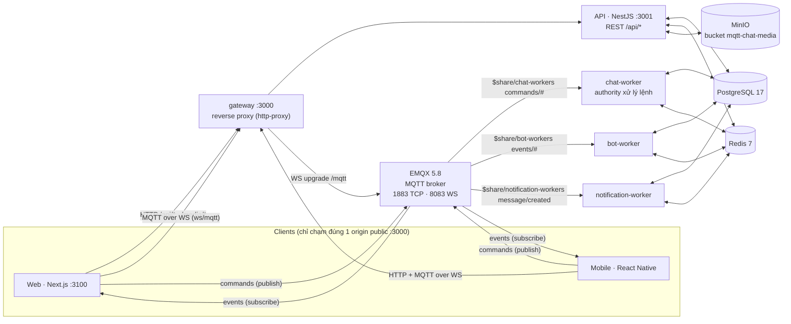

_Đúng theo code: gateway route `/api*`,`/media*` → API, WS `/mqtt` → EMQX, còn lại catch-all → web (`apps/gateway/src/index.ts:52-80`). Ký hiệu `$share/{group}/…` là **shared subscription** MQTT — nhiều worker cùng group chia nhau nhận message (giải thích ở §2.2); pattern đầy đủ là `$share/chat-workers/chat/v1/commands/#`._

Source:

- `docs/architecture.md`, `apps/gateway/src/index.ts`
- `package.json`, `pnpm-workspace.yaml`, `docker-compose.yml`

---

## 2. MQTT từ con số 0

_Phần dành cho người chưa từng nghe tới MQTT._

### 2.1 MQTT là gì?

**MQTT = Message Queuing Telemetry Transport** — một giao thức nhắn tin gọn nhẹ (chỉ vài byte header) chạy trên nền TCP, sinh ra năm 1999 cho cảm biến dầu khí có băng thông rất thấp, ngày nay trở thành chuẩn de-facto cho IoT và cũng rất phù hợp cho **chat realtime**.

Mô hình trung tâm của MQTT là **publish/subscribe (pub/sub)**, khác với mô hình "gửi thẳng cho nhau" (point-to-point):

- **Publisher** — bên _đăng tải_ thông điệp. Nó KHÔNG biết ai sẽ đọc.
- **Subscriber** — bên _đăng ký_ nhận thông điệp theo chủ đề quan tâm.
- **Broker** — "bưu điện" đứng giữa: nhận mọi thông điệp từ publisher, phân phát đến đúng các subscriber. Trong hệ thống này broker là **EMQX 5.8**.
- **Topic** — "địa chỉ chủ đề", là một chuỗi phân tầng bằng dấu `/`, ví dụ `chat/v1/events/message/created`.
- **Payload** — phần nội dung thông điệp (ở đây luôn là JSON có schema Zod).

```text
Client A (người gửi)
   │
   │ PUBLISH "chat/v1/commands/message/send"
   ▼
┌──────────────┐
│  EMQX Broker │   ← hệ thống này dùng emqx/emqx:5.8 (docker-compose.yml:34)
└──────────────┘
   │
   ├──► Subscriber: User B (web/mobile) — nhận event, hiện tin nhắn
   ├──► Subscriber: bot-worker ($share/bot-workers/chat/v1/events/#) — chạy rule bot
   └──► Subscriber: notification-worker ($share/notification-workers/…) — push thông báo
```

Điểm mấu chốt: **A và B không hề kết nối trực tiếp với nhau**. Cả hai chỉ kết nối tới broker. Muốn thêm loại subscriber mới (bot, analytics…), không cần sửa gì ở client.

### 2.2 Các khái niệm MQTT — bản hệ thống này có dùng hay không?

| Khái niệm                                  | Ý nghĩa                                                                                           | Hệ thống này                                                                                                                                                          |
| ------------------------------------------ | ------------------------------------------------------------------------------------------------- | --------------------------------------------------------------------------------------------------------------------------------------------------------------------- |
| **QoS 0** ("at most once")                 | Gửi 1 lần, không xác nhận — mất được, nhanh nhất                                                  | ✅ Dùng cho dữ liệu _ephemeral_: typing started/stopped, bot observability (`packages/mqtt-contracts/src/qos.ts:11-13`)                                               |
| **QoS 1** ("at least once")                | Bên nhận gửi lại PUBACK; chưa ack thì broker gửi lại → có thể trùng                               | ✅ Dùng cho TOÀN BỘ command và event quan trọng (`qos.ts:6-10`). Trùng lặp được xử lý bằng idempotency (§13)                                                          |
| **QoS 2** ("exactly once")                 | Bắt tay 4 bước, chắc chắn không trùng nhưng tốn kém                                               | ❌ Cố tình tránh — comment "deliberately avoided … adds overhead" (`qos.ts:3`)                                                                                        |
| **Retained message**                       | Broker giữ tin cuối cùng, client subscribe mới nhận ngay                                          | ❌ Không dùng ở bất kỳ đâu (`packages/mqtt/src/index.ts:113-125` không có tuỳ chọn retain; will hardcode `retain:false` `realtime-core/src/index.ts:329`)             |
| **Last Will (LWT)**                        | Client đăng ký trước "di chúc": nếu mất kết nối đột ngột, broker tự publish giùm                  | ✅ Dùng cho web + mobile: will = lệnh `presence.set {isOnline:false}` — mất mạng là broker tự báo offline giúp client (`apps/web/src/lib/realtime-service.ts:89-104`) |
| **Persistent session** (`clean=false`)     | Broker nhớ subscription + tin pending cho client offline quay lại                                 | ❌ Luôn `clean:true` (`realtime-core/src/index.ts:325`). Việc "bắt tin lỡ" được giải bằng sequence + HTTP backfill (§14, §18)                                         |
| **Keepalive**                              | Ping định kỳ để broker phát hiện chết nối                                                         | ✅ 30 giây (`realtime-core/src/index.ts:326`; `packages/mqtt/src/index.ts:43`)                                                                                        |
| **Wildcard `#`**                           | Đăng ký cả một nhánh topic                                                                        | ✅ Dùng ở 4 ngữ cảnh: `commands/#`, `events/#`, `users/{id}/events/#`, và trong $share pattern                                                                        |
| **Wildcard `+`**                           | Đăng ký đúng 1 tầng bất kỳ                                                                        | ❌ Không được dùng ở đâu trong repo (grep toàn repo = 0 match)                                                                                                        |
| **Shared subscription `$share/{group}/…`** | Nhiều instance cùng group chia nhau nhận message (load-balance), mỗi message chỉ 1 instance xử lý | ✅ 3 group: `chat-workers`, `bot-workers`, `notification-workers` (`packages/mqtt-contracts/src/topics.ts:102-104`)                                                   |

### 2.3 Ví dụ trực quan với hệ thống chat này

Alice mở chat với Bob và gõ "Chào Bob":

1. Web của Alice **publish** một _command_ lên topic `chat/v1/commands/message/send` — đây là "yêu cầu", chưa phải sự thật.
2. EMQX chuyển command đó cho **duy nhất một** chat-worker (nhờ shared subscription `$share/chat-workers/...`).
3. chat-worker kiểm tra Alice có thuộc hội thoại không → cấp số thứ tự → ghi PostgreSQL → phát _event_ chính thức `chat/v1/events/message/created`.
4. EMQX fan-out event này tới **tất cả** subscriber đang nghe `chat/v1/events/#`: web của Bob (hiện bubble), mobile, bot-worker (có thể auto-reply), notification-worker (nếu Bob đang offline thì push).
5. Bob nhận tin gần như tức thời — Alice và Bob không hề biết địa chỉ IP của nhau.

---

## 3. Phân vai các kênh trong hệ thống

Câu hỏi thường gặp: _"Có MQTT rồi sao còn HTTP? WebSocket đâu?"_

| Kênh                                   | Dùng cho việc gì                                                                                                                                                | Vì sao                                                            |
| -------------------------------------- | --------------------------------------------------------------------------------------------------------------------------------------------------------------- | ----------------------------------------------------------------- |
| **MQTT (qua WebSocket `ws://…/mqtt`)** | Toàn bộ hành vi realtime: gửi/sửa/xoá tin, reaction, receipt đọc, typing, presence, bot send, và nhận mọi event                                                 | Kết nối bền, nhẹ, QoS1 redelivery, wildcard fan-out, LWT presence |
| **HTTP REST `/api/*`**                 | Những việc không realtime: load lịch sử tin (cursor pagination), danh sách conversation/user, upload file (multipart), CRUD bot/rule, admin stats, health check | Request/response một lần là đủ; binary không bao giờ đi qua MQTT  |
| **WebSocket thuần**                    | ❌ Không tồn tại kênh WebSocket riêng nào ngoài chính **MQTT-over-WebSocket** (transport của mqtt.js tới cổng 8083 qua gateway)                                 | Một kênh realtime duy nhất, tránh nhân đôi state                  |
| **PostgreSQL**                         | Source of truth: users, conversations, members, messages, reactions, outbox, bot + logs                                                                         | Dữ liệu phải sống sót qua restart                                 |
| **Redis**                              | State tạm/ephemeral: presence multi-device (set), typing (key TTL 8s), unread counter, bot cooldown/state, audit notification (TTL 600s)                        | Dữ liệu mất được hoặc có thể dựng lại, cần tốc độ                 |
| **MinIO (S3 API)**                     | File media: ảnh/video/audio/pdf                                                                                                                                 | Binary lớn; message chỉ mang metadata                             |
| **Workers**                            | chat-worker: thẩm quyền xử lý command → DB → publish event. bot-worker: tự động hoá. notification-worker: push cho user offline                                 | Tách client khỏi quyền ghi DB                                     |

Nguyên tắc vàng của hệ thống (**Commands ≠ Events**, `docs/architecture.md:48`):

> Client chỉ được _xin_ (publish **command**). Sau khi database commit thành công, hệ thống mới phát ra **event** — sự kiện chính thức, kèm số thứ tự, mà mọi bên (kể cả chính người gửi) đều tin theo.

Source:

- `packages/mqtt-contracts/src/qos.ts`, `topics.ts`
- `apps/web/src/lib/realtime-service.ts:89-104` (LWT)
- `apps/api/src/controllers/uploads.controller.ts:23-31` (binary never through MQTT)

---

# PHẦN II — KIẾN TRÚC & CÔNG NGHỆ

## 4. Kiến trúc tổng quan

### 4.1 Nguyên tắc kiến trúc (đọc từ code + `.agent/rules/01-architecture.md`)

1. **Server-authoritative** — client không bao giờ tự quyết định tin nhắn "đã gửi". Chỉ chat-worker, sau khi PostgreSQL commit, mới phát ra event chính thức. Client hiển thị theo event đó.
2. **Commands ≠ Events** — hai namespace topic tách bạch: `chat/v1/commands/*` (yêu cầu) do client/bot publish; `chat/v1/events/*` (sự thật) chỉ do chat-worker phát.
3. **Transactional outbox** — ghi dữ liệu nghiệp vụ và hàng đợi sự kiện trong **cùng một transaction** PostgreSQL; sau đó một publisher riêng rẽ drain hàng đợi này ra MQTT. Lợi ích: không bao giờ "lưu DB rồi quên phát", hay "phát rồi lưu thất bại".
4. **Monotonic sequence per conversation** — số thứ tự tin nhắn được cấp bằng `UPDATE Conversation SET lastSequence = lastSequence + 1 RETURNING …` trong cùng transaction (không bao giờ đọc `MAX(sequence)+1`), kèm unique constraint `(conversationId, sequence)` làm lưới an toàn.
5. **Idempotency end-to-end** — command mang `clientMessageId` (unique ở DB); event mang `eventId`. QoS1 redelivery không tạo bản sao.
6. **Horizontal scale cho worker** — các worker dùng MQTT shared subscription (`$share/{group}/…`) nên có thể chạy nhiều instance chia nhau tải.
7. **Multi-device presence** — Redis set lưu danh sách thiết bị online của mỗi user; user chỉ offline khi set rỗng. LWT xử lý mất kết nối đột ngột.
8. **Media qua HTTP API** — binary upload multipart tới MinIO với key durable; message trên MQTT chỉ mang metadata; URL được resolve lúc ĐỌC nên không tồn tại signed URL hết hạn.

### 4.2 Luồng dữ liệu tổng quát

```text
                    ┌────────────┐   commands    ┌───────────────┐
   Web/Mobile ─────►│   EMQX     │──────────────►│  chat-worker  │
   (publish cmd)    │   broker   │  $share/      │  validate →   │
                    │            │  chat-workers │  dedup → seq →│──┐
   Web/Mobile ◄─────│            │◄──────────────│  TX commit    │  │
   (subscribe evts) └────────────┘   events      └───────────────┘  │
        ▲                  ▲                                        ▼
        │                  │ events                        ┌───────────────┐
        │                  └──────────── outbox publisher ──│  PostgreSQL   │
        │                          (poll 500ms)             │  (source of   │
   bot-worker ◄── $share/bot-workers/events/#              │   truth)      │
   notification-worker ◄── $share/…/message/created        └───────────────┘
```

### 4.3 Quy tắc phụ thuộc package

```text
apps → packages ✓        packages → apps ✗   (không được vi phạm)
shared-types ← mqtt-contracts ← mqtt / realtime-core ← apps
```

Mỗi package chỉ expose public API qua `src/index.ts`. Toàn bộ topic string và schema nằm tập trung ở **một** package: `packages/mqtt-contracts`.

Source:

- `docs/architecture.md`, `.agent/rules/01-architecture.md`, `07-database.md`
- `apps/chat-worker/src/handlers/messages.ts:121-169`, `apps/chat-worker/src/outbox.ts`

---

## 5. Inventory toàn bộ hệ thống

| Component               | Path                       | Technology                                                | Responsibility                                                                                                                                                                                                                    | Depends On                                            | Exposes                                                           |
| ----------------------- | -------------------------- | --------------------------------------------------------- | --------------------------------------------------------------------------------------------------------------------------------------------------------------------------------------------------------------------------------- | ----------------------------------------------------- | ----------------------------------------------------------------- |
| **gateway**             | `apps/gateway`             | Node.js `node:http` + http-proxy ^1.18.1                  | Reverse proxy — public origin duy nhất :3000; route `/api*`,`/media*` → API, WS `/mqtt` → EMQX, catch-all → web                                                                                                                   | config                                                | HTTP :3000 + WS passthrough                                       |
| **api**                 | `apps/api`                 | NestJS ^11.1.0 (Express), zod                             | REST `/api/*`: users, conversations, members, messages history (cursor), uploads multipart, media stream, bots CRUD, admin stats, presence snapshot, health                                                                       | database, redis, storage, mqtt-contracts, config      | 28 route dưới `/api` + root `GET /`                               |
| **web**                 | `apps/web`                 | Next.js ^16.3.2 (App Router), React 19, zustand, Tailwind | Chat workspace (`/`, `/chat`) + admin dashboard (`/admin`); publish commands, consume events qua realtime-core                                                                                                                    | realtime-core, mqtt-contracts, ui                     | UI tại :3100 (nội bộ, qua gateway)                                |
| **mobile**              | `apps/mobile`              | React Native 0.87.0 bare CLI (Hermes, New Arch), Jest     | App chat iOS/Android dùng chung contract + realtime-core; custom router 5 màn hình                                                                                                                                                | realtime-core, mqtt-contracts                         | Native app (metro :8081 dev)                                      |
| **chat-worker**         | `apps/chat-worker`         | TypeScript (tsx runtime), mqtt, prisma, ioredis           | **Authority**: consume `$share/chat-workers/commands/#`, validate Zod, dedup, cấp sequence, ghi Message+OutboxEvent cùng transaction, drain outbox publish QoS1                                                                   | mqtt, mqtt-contracts, database, redis, logger, config | MQTT consumer/publisher; OutboxPublisher duy nhất                 |
| **bot-worker**          | `apps/bot-worker`          | TypeScript (tsx), bot-sdk, bot-rules                      | Consume mọi event (`$share/bot-workers/events/#`): rule engine (DB-driven, refresh 5s), slash-command engine, scheduler job lịch                                                                                                  | mqtt, bot-sdk, bot-rules, database, redis             | Publish `bot.send` / `reaction.add` commands; observability topic |
| **notification-worker** | `apps/notification-worker` | TypeScript (tsx)                                          | Consume `message.created`; nếu recipient OFFLINE (Redis presence set rỗng) → dispatch qua provider abstraction (hiện chỉ Console demo provider); audit Redis TTL 600s                                                             | mqtt, database, redis                                 | Console notification (demo)                                       |
| **database**            | `packages/database`        | Prisma ^6.6.0 + PostgreSQL 17                             | Schema 13 model, migrations, seed data demo                                                                                                                                                                                       | —                                                     | Prisma client factory, `directPairKeyFor()` helper                |
| **mqtt-contracts**      | `packages/mqtt-contracts`  | zod ^3.24.3                                               | **Single source of truth**: envelope schemas, 10 command schemas, 16 event types phát thật (map `EVENT_SCHEMAS` chỉ có 15 — thiếu receipt.delivered, xem §9.5), toàn bộ topic constants + builders, QoS policy, media MIME policy | shared-types, zod                                     | Schemas + topics + QoS + media utils                              |
| **mqtt**                | `packages/mqtt`            | mqtt.js ^5.10.1                                           | Server-side connection plumbing: factory client (keepalive 30s, reconnect 2s), deferred-ack bridge (PUBACK sau khi handler settle), helpers subscribe/publishJson                                                                 | mqtt-contracts, logger, config                        | `createMqttClient`, deferred-ack `handleMessage`                  |
| **realtime-core**       | `packages/realtime-core`   | mqtt.js ^5.10.1                                           | Client layer duy nhất được import `mqtt` (web/RN/admin): `ChatRealtimeClient` (connect, LWT, resubscribe-on-reconnect, command helpers, normalize message/conversation)                                                           | mqtt-contracts, mqtt                                  | `ChatRealtimeClient` class + normalizers                          |
| **redis**               | `packages/redis`           | ioredis ^5.6.1                                            | Presence sets, typing TTL keys, unread counters, bot cooldown/state, notify audit — tất cả qua key builders                                                                                                                       | logger, config                                        | Repository functions                                              |
| **storage**             | `packages/storage`         | @aws-sdk/client-s3 ^3.787.0                               | PutObject/GetObject MinIO; key builder `media/{conversationId}/{ts}-{name}` + pattern guard                                                                                                                                       | config                                                | Storage service + key pattern                                     |
| **logger**              | `packages/logger`          | pino ^9.6.0 (+pino-pretty)                                | Structured JSON logs, base `{service}`, level từ LOG_LEVEL                                                                                                                                                                        | pino                                                  | `createLogger({service})`                                         |
| **config**              | `packages/config`          | zod                                                       | Env validation fail-fast per app (gateway/api/workers)                                                                                                                                                                            | zod                                                   | `loadGatewayEnv`, `loadServerEnv`, …                              |
| **shared-types**        | `packages/shared-types`    | (thuần TS, 0 deps)                                        | Enums/types dùng chung: ConversationType, MemberRole, SenderType, MessageType, ReceiptState, DEMO_USERS, ApiErrorBody…                                                                                                            | —                                                     | Types                                                             |
| **ui**                  | `packages/ui`              | clsx, peer react ^19                                      | Shared React components (vd ConnectionBadge)                                                                                                                                                                                      | react                                                 | Components                                                        |
| **bot-sdk**             | `packages/bot-sdk`         | contracts, zod                                            | SDK viết bot: class `Bot` fluent API (command/onMessage/state), transport interface, state store                                                                                                                                  | mqtt-contracts, bot-rules                             | `Bot`, `BotContext`, parser                                       |
| **bot-rules**           | `packages/bot-rules`       | zod                                                       | Schema + condition engine declarative cho rule (12 operators, 14 action types, không eval JS)                                                                                                                                     | zod                                                   | `parseRuleDefinition`, `evaluateCondition`                        |
| **testing**             | `packages/testing`         | logger                                                    | Test helpers                                                                                                                                                                                                                      | logger                                                | Utilities                                                         |
| **tooling/typescript**  | `tooling/typescript`       | tsconfig presets                                          | base.json (strict, noUncheckedIndexedAccess, ES2022, decorator cho NestJS), nextjs.json, react-library.json                                                                                                                       | —                                                     | tsconfig                                                          |

> Hạ tầng chạy bằng Docker Compose (chỉ infra, không có app nào trong compose): postgres:17-alpine, redis:7-alpine (appendonly), emqx/emqx:5.8 (anonymous OK — chủ đích demo), minio + minio-init (tạo bucket `mqtt-chat-media`).

---

## 6. Technology Stack

### 6.1 Ngôn ngữ & nền tảng

| Công nghệ        | Version                     | Dùng ở                                         | Mục đích                                                    | Vì sao quan trọng                             |
| ---------------- | --------------------------- | ---------------------------------------------- | ----------------------------------------------------------- | --------------------------------------------- |
| TypeScript       | ^5.8.3 (mobile khai ^6.0.3) | Toàn bộ repo                                   | Ngôn ngữ chính                                              | Type safety xuyên suốt client→worker→contract |
| Node.js          | >=22 (root engines)         | gateway, api, workers                          | Runtime server-side                                         | ESM + hiệu năng V8 hiện đại                   |
| SQL              | PostgreSQL dialect          | migrations, 3 chỗ `$queryRaw` tagged-template  | Sequence increment, outbox drain (`FOR UPDATE SKIP LOCKED`) | Race-safe operations                          |
| Shell/JS scripts | `.mjs`/`.mts`               | `scripts/*` (21 file, gồm `lib/`, `fixtures/`) | E2E orchestration, probes                                   | Không cần framework test ngoài                |

### 6.2 Backend & messaging

| Công nghệ          | Version              | Dùng ở                                | Mục đích                                                 | Vì sao quan trọng                                                  |
| ------------------ | -------------------- | ------------------------------------- | -------------------------------------------------------- | ------------------------------------------------------------------ |
| NestJS             | ^11.1.0 (cài 11.2.1) | apps/api                              | REST framework (Express adapter)                         | Module/DI/Pipe chuẩn hoá controllers                               |
| mqtt.js            | ^5.10.1 (cài 5.15.2) | packages/mqtt, packages/realtime-core | MQTT 5/3.1.1 client                                      | Nền realtime duy nhất; hỗ trợ deferred-ack override                |
| EMQX               | emqx/emqx:5.8        | docker-compose                        | MQTT broker                                              | Shared subscription ($share), WebSocket listener, dashboard :18083 |
| ioredis            | ^5.6.1               | packages/redis + api                  | Redis client                                             | Presence/typing/unread/bot-state ephemeral state                   |
| Prisma             | ^6.6.0               | packages/database                     | ORM + migration                                          | Type-safe DB access; P2002 unique-violation làm cơ chế dedup       |
| PostgreSQL         | postgres:17-alpine   | docker-compose                        | Database                                                 | Source of truth; row-lock để cấp sequence                          |
| @aws-sdk/client-s3 | ^3.787.0             | packages/storage                      | Object storage client (MinIO-compatible, forcePathStyle) | Media durable keys                                                 |
| Multer             | 2.2.0                | apps/api (qua platform-express)       | Multipart parsing                                        | Upload 50MB cap (memoryStorage)                                    |
| tsx                | ^4.x                 | api, workers, gateway                 | Chạy TypeScript trực tiếp (dev + start)                  | Không cần bước build cho services                                  |

### 6.3 Frontend & mobile

| Công nghệ                                    | Version                       | Dùng ở               | Mục đích               | Vì sao quan trọng                                                      |
| -------------------------------------------- | ----------------------------- | -------------------- | ---------------------- | ---------------------------------------------------------------------- |
| Next.js                                      | ^16.3.2 (App Router)          | apps/web             | Web framework          | Route `/`, `/chat`, `/admin` đều client component                      |
| React / React DOM                            | 19.2.x                        | web + mobile         | UI library             | Concurrent rendering, hooks                                            |
| zustand                                      | ^5.0.4 (cài 5.0.15)           | apps/web             | State management       | 1 store duy nhất cho conversations/messages/presence/typing/connection |
| Tailwind CSS                                 | ^3.4.17                       | apps/web (+admin cũ) | Styling                | Design tokens nhất quán                                                |
| React Native                                 | 0.87.0 (bare CLI, KHÔNG Expo) | apps/mobile          | Mobile app             | Hermes + New Architecture bật                                          |
| react-native-image-picker / documents-picker | ^8.2.1 / ^10.1.7              | apps/mobile          | Chọn ảnh/file          | Media flow mobile (PDF only cho document)                              |
| react-native-safe-area-context               | ^5.5.2                        | apps/mobile          | Layout an toàn tai thỏ | —                                                                      |
| Jest                                         | ^29.6.3                       | apps/mobile          | Unit test RN           | 4 suite / 35 test case                                                 |

### 6.4 Contract & validation

| Công nghệ       | Version | Dùng ở                                            | Mục đích                                                                                                      |
| --------------- | ------- | ------------------------------------------------- | ------------------------------------------------------------------------------------------------------------- |
| Zod             | ^3.24.3 | mqtt-contracts, api controllers, config           | Schema validation tại MỌI boundary: MQTT command envelope, REST body (ZodValidationPipe), env vars, bot rules |
| Generated types | —       | `EventEnvelope<T>`, `CommandEnvelope<T>` generics | Type inference từ schema ra type, không duplicate tay                                                         |

### 6.5 Testing

| Công nghệ          | Version                                                  | Phạm vi                                                                                         |
| ------------------ | -------------------------------------------------------- | ----------------------------------------------------------------------------------------------- |
| Vitest             | ^3.1.3                                                   | 10 file unit/integration (packages + apps, trừ mobile): 92 test                                 |
| Jest + RN preset   | ^29.6.3                                                  | Mobile: 4 file / 35 test case                                                                   |
| Puppeteer-core     | ^25.8.0 + system Chrome                                  | Browser E2E qua public origin :3000 (single-origin gate)                                        |
| Custom E2E harness | `scripts/test-stack.mjs`                                 | Isolated stack: API :3011, DB `mqtt_chat_test`, Redis db 1, topic fence `chat/v1-e2e`; 9 suites |
| Probes             | `scroll-acceptance.mjs` (300 msg), `mqtt-leak-probe.mjs` | Acceptance test scroll + subscription-leak                                                      |

### 6.6 Tooling & hạ tầng dev

| Công nghệ          | Version                                           | Mục đích                                                           |
| ------------------ | ------------------------------------------------- | ------------------------------------------------------------------ |
| pnpm               | 10.20.0 (packageManager)                          | Workspace manager (apps/_, packages/_, tooling/*)                  |
| Turborepo          | ^2.5.4                                            | Task pipeline build/dev/typecheck/test theo dependency graph       |
| ESLint             | ^9.26 flat config, typescript-eslint type-checked | no-floating-promises, consistent-type-imports, react-hooks         |
| Prettier           | ^3.5.3                                            | Format (printWidth 100, double quote)                              |
| Docker Compose     | —                                                 | Infra only: Postgres, Redis, EMQX, MinIO (+ minio-init bucket job) |
| pino / pino-pretty | ^9.6.0 / ^13                                      | Structured logging                                                 |

> ❌ **Không tồn tại:** CI/CD workflow (không có `.github/`), Dockerfile cho bất kỳ app nào, Kubernetes/Terraform/Vercel config, OpenTelemetry/metrics stack. Chi tiết xem §32, §33, Phụ lục B.

---

# PHẦN III — APPLICATION / SERVICE BREAKDOWN

## 7. Application / Service Breakdown

### 7.1 gateway — cổng vào duy nhất

- **Nhiệm vụ:** là **origin công khai duy nhất** `http://localhost:3000`. Client (web/mobile/admin) chỉ cần biết một địa chỉ; gateway điều hướng nội bộ.
- **Entrypoint:** `apps/gateway/src/index.ts` — không framework, thuần `node:http` + `http-proxy`.
- **Routing thực tế trong code:**

| Request                    | Đi đâu                                                                          |
| -------------------------- | ------------------------------------------------------------------------------- |
| `/api`, `/api/*`           | → `API_ORIGIN` (http://127.0.0.1:3001)                                          |
| `/media`, `/media/*`       | → `${API_ORIGIN}/api` (rewrite path để upstream nhận `/api/media?key=…`)        |
| WS upgrade `/mqtt*`        | → `EMQX_WS_ORIGIN` (ws://127.0.0.1:8083)                                        |
| WS khác (vd `/_next/` HMR) | → web :3100                                                                     |
| **Mọi HTTP path khác**     | → catch-all về web :3100 (`/`, `/chat`, `/admin` không được liệt kê tường minh) |

- **Tuỳ chọn proxy:** `xfwd:true` (thêm X-Forwarded-*), timeout 30s, upstream lỗi → 502 JSON `{error:{code:"BAD_GATEWAY"}}`.
- **KHÔNG có:** auth, rate-limit, static serving (chỉ proxy), retry/backoff.
- **Graceful shutdown:** SIGTERM/SIGINT → closeIdleConnections → force-close sau 5s.

Source: `apps/gateway/src/index.ts:15-118`, `packages/config/src/index.ts:72-76`

### 7.2 api — REST backend (NestJS)

- **Nhiệm vụ:** mọi thao tác không-realtime + các mutation lifecycle mà client gọi bằng HTTP (tạo/xoá conversation, member management, upload).
- **Bootstrap:** port 3001 (`PORT ?? 3001`, E2E override 3011), global prefix `/api` (trừ root `GET /`), CORS `origin:true` (reflect mọi origin — comment "demo"), zod env fail-fast.
- **Auth:** ❌ **không tồn tại bất kỳ cơ chế nào** — không login/register/JWT/cookie/session/password. Quyền "actor" = query param tự khai báo `?actor=<userId>`. Xem §24.
- **MQTT interaction:** API **không publish MQTT trực tiếp**. Với các event conversation.* nó chỉ ghi row `OutboxEvent` trong cùng transaction; chat-worker là process duy nhất drain outbox lên EMQX.
- **DB access:** `PrismaService extends PrismaClient`; Redis read-only (presence snapshot + health ping).

**Bảng route đầy đủ (28 route + root):**

| Method & Path                                                 | Chức năng                                                | Ghi DB                        | Outbox event                 |
| ------------------------------------------------------------- | -------------------------------------------------------- | ----------------------------- | ---------------------------- |
| GET `/` (no prefix)                                           | Service identity probe                                   | —                             | —                            |
| GET `/api/health`                                             | DB `SELECT 1` + Redis ping → ok/degraded                 | —                             | —                            |
| GET `/api/presence?userIds=`                                  | Snapshot presence từ Redis (max 100 user)                | —                             | —                            |
| GET `/api/users?includeBots=`                                 | Danh sách user (loại `system-bot*` trừ khi hỏi)          | —                             | —                            |
| POST `/api/users`                                             | Upsert user demo (id tự chọn ≤64 ký tự)                  | user.upsert                   | —                            |
| DELETE `/api/users/:id`                                       | Xoá user; còn message → 404 USER_HAS_MESSAGES            | user.delete                   | —                            |
| GET `/api/conversations?userId=`                              | List theo membership, loại tombstone, kèm preview        | —                             | —                            |
| POST `/api/conversations`                                     | Tạo GROUP hoặc DIRECT (unique pair-key)                  | conversation + members (1 tx) | `conversation.created`       |
| DELETE `/api/conversations/:id?actor=`                        | Tombstone group (ADMIN-only, idempotent)                 | deletedAt/deletedBy           | `conversation.deleted`       |
| GET `/api/conversations/:id`                                  | Chi tiết (tombstoned → 404)                              | —                             | —                            |
| POST `/api/conversations/:id/members?actor=`                  | Thêm member (ADMIN, GROUP-only)                          | createMany skipDuplicates     | `conversation.member-joined` |
| DELETE `/api/conversations/:id/members/:userId?actor=`        | Leave/remove; sole-admin promote successor               | deleteMany                    | `conversation.member-left`   |
| GET `/api/conversations/:id/messages?before&after&limit`      | Lịch sử cursor theo sequence (limit 1..100, default 50)  | —                             | —                            |
| GET `/api/messages/:id`                                       | Một tin nhắn + reactions                                 | —                             | —                            |
| POST `/api/uploads` (multipart)                               | Upload media → MinIO (§16)                               | không ghi bảng nào            | —                            |
| GET `/api/media?key=`                                         | Stream object server-side, immutable cache               | —                             | —                            |
| GET/POST/PATCH `/api/bots`, `/api/bots/:id`                   | CRUD bot                                                 | bot upsert/update             | —                            |
| GET/POST `/api/bots/:id/rules`                                | CRUD rule (zod + safeParseRuleDefinition)                | rule create/deleteMany        | —                            |
| PATCH/DELETE `/api/bots/:id/rules/:ruleId`                    | Toggle/sửa rule (re-validate trigger/conditions/actions) | —                             | —                            |
| GET `/api/bots/:id/logs`, `/api/admin/bots/:id/logs`          | Bot logs (events/commands/executions, take 50)           | —                             | —                            |
| GET `/api/admin/stats` `/api/admin/users` `/api/admin/events` | Dashboard data (events take ≤500)                        | count aggregate               | —                            |

- **Error envelope chuẩn:** `{error:{code,message,details,requestId}}` qua GlobalExceptionFilter; ZodValidationPipe → 400 `VALIDATION_ERROR`.

Source: `apps/api/src/main.ts`, `app.module.ts:24-108`, `controllers/chat.controller.ts`, `uploads.controller.ts`, `media.controller.ts`, `bots.controller.ts`, `admin.controller.ts`

### 7.3 chat-worker — "trái tim" authority của hệ thống

- **Consume gì:** `$share/chat-workers/chat/v1/commands/#` QoS1, clean session true, clientId `chat-worker-{pid}-{ts}`.
- **Ack model:** **deferred ack** — override `client.handleMessage`: PUBACK chỉ gửi sau khi handler settle; handler throw ⇒ không PUBACK ⇒ broker redeliver (cho chính nó hoặc instance khác trong group). Crash-safe at-least-once.
- **Pipeline xử lý `message.send` (đúng thứ tự code):**

```text
1. JSON.parse + commandEnvelopeSchema.parse        worker.ts:92-101
2. safeParse(COMMAND_SCHEMAS[commandType].data)    worker.ts:103-117
3. Membership check (conversationMember.findUnique) messages.ts:91-97
4. Tombstone check (conversation.deletedAt → reject) messages.ts:100-107
5. replyToId: target tồn tại + cùng conversation    messages.ts:111-117
6. TRANSACTION (ReadCommitted):
   a. UPDATE Conversation SET lastSequence=lastSequence+1 RETURNING   :124-132
   b. message.create (sequence, clientMessageId…)                     :134-146
   c. outboxEvent.create (message.created envelope)                   :157-165
7. PUBACK (sau khi tx commit)
8. Redis unread counter cho member khác (best-effort, ngoài tx)      :172-181
9. OutboxPublisher poll 500ms → FOR UPDATE SKIP LOCKED batch 50
   → publishJson QoS1 → mark publishedAt                             outbox.ts:71-99
```

- **Dedup duplicate:** bắt Prisma lỗi `P2002` trên unique `Message.clientMessageId` → tìm theo clientMessageId → cùng conversation thì **ack im lặng** (không emit thêm event); khác conversation (collision hiếm) → throw ⇒ redelivery loop (xem Phụ lục B).
- **Các command khác:**

| Command                  | Guard riêng                      | DB write                               | Event                          |
| ------------------------ | -------------------------------- | -------------------------------------- | ------------------------------ |
| `message.edit`           | author-only (senderType USER)    | content + editedAt                     | `message.edited`               |
| `message.delete`         | author HOẶC ADMIN                | soft-delete `deletedAt` + `content=""` | `message.deleted`              |
| `reaction.add/remove`    | membership                       | upsert / delete composite PK           | `reaction.added/removed`       |
| `receipt.read/delivered` | membership + watermark monotonic | lastRead/lastDeliveredSequence         | per-user topic mỗi member khác |
| `presence.set`           | actor userId+deviceId            | Device.upsert                          | `presence.online/offline`      |
| `typing.set`             | membership                       | KHÔNG (Redis TTL 8s)                   | `typing.started/stopped` QoS0  |
| `bot.send`               | bot enabled + là member          | như send, senderType BOT               | `message.created` origin bot   |

- **Publish trực tiếp (không qua outbox):** `typing.started/stopped` (QoS0) và `message.rejected` (QoS1 best-effort về originator). Mọi event còn lại đi qua outbox.
- **Thất bại:** invalid JSON/schema → log + ack-drop (poison không block); non-member/tombstone/reply sai (với send) → `message.rejected`; DB down lúc start → exit 1; outbox publish fail → attemptCount++ tới 10 rồi nằm lại unpublished (**không có dead-letter**).
- **Shutdown:** unsubscribe trước → drain in-flight ≤10s → nack phần còn lại.

Source: `apps/chat-worker/src/index.ts`, `worker.ts:41-127`, `handlers/messages.ts`, `handlers/receipts.ts`, `handlers/presence.ts`, `handlers/typing.ts`, `handlers/bot-send.ts`, `outbox.ts`

### 7.4 bot-worker — tự động hoá

- **Trigger:** subscribe `$share/bot-workers/chat/v1/events/#` QoS1 — nhận MỌI event type; SDK chỉ chạy message/command handlers cho `message.created` nhưng vẫn chạy per-event handlers (vd presence online/offline).
- **Ba thành phần:** Command engine (slash-command handler cho 4 lệnh cần dữ liệu live: `/status /users /stats /room`; còn `/help`, `/ping` là seeded _rules_ của rule engine), Rule engine (rules lưu PostgreSQL, zod-validate, refresh cache mỗi 5s; trigger→conditions→actions; cooldown Redis SET NX EX 2s), Scheduler (bảng `BotScheduledJob`, poll 1s, `FOR UPDATE SKIP LOCKED LIMIT 10`, MAX_ATTEMPTS 5, recurring reschedule).
- **Bot identity:** User thật `system-bot` trong DB (bắt buộc vì FK Message.sender) + row bảng `Bot` (settings `{commandPrefix:"/", allowBotMessages:false, maxAutomationDepth:3}`) + phải là ConversationMember mới gửi được.
- **Response lifecycle:** bot KHÔNG BAO GIỜ publish event trực tiếp — chỉ publish command `bot.send` → đi qua CÙNG canonical pipeline của chat-worker (validate → sequence++ → Message senderType BOT → OutboxEvent → publish). Kết luận: **bot message là citizen hạng nhất** của hệ thống.
- **Loop protection:** bỏ qua mọi envelope `origin.type === "bot"` (trừ khi `allowBotMessages=true`) + depth guard + cooldown.
- **Không có:** typing simulation trước khi trả lời (chỉ action `delay`, seed dùng 1500ms); dedup theo eventId ở phía bot (redelivery của event gốc ⇒ bot có thể phản hồi 2 lần với clientMessageId khác nhau).

Chi tiết luồng bot xem §23.

Source: `apps/bot-worker/src/index.ts:53-158`, `rule-engine.ts`, `scheduler.ts`, `transport.ts`, `packages/bot-sdk/src/bot.ts`, `packages/database/src/seed.ts:176-268`

### 7.5 notification-worker

- **Consume:** đúng 1 topic `$share/notification-workers/chat/v1/events/message/created` (exact topic, QoS1).
- **Khi nào tạo notification:** mỗi `message.created` → query members → loại sender → với từng recipient: nếu `SCARD presence:user:{id} > 0` (đang online) thì **bỏ qua**; offline thì dispatch. Bot message vẫn được push; message SYSTEM bị skip. Không có khái niệm mute.
- **Delivery:** provider abstraction `NotificationProvider {name, send}` — implementation duy nhất hiện nay là `ConsoleNotificationProvider` (console.log). **Không có FCM/APNs/push thật** (chỉ xuất hiện trong comment).
- **Persistence:** không ghi bảng DB nào; audit trail là Redis key `notify:delivered:{recipient}:{messageId}` TTL 600s.
- **Lỗi:** Redis lỗi khi check online → coi như online (an toàn, bỏ push). Ack ngay sau khi parse (không deferred-ack) ⇒ crash giữa chừng làm mất notification (đánh giá risk §37).

Source: `apps/notification-worker/src/index.ts:37-179`, `packages/redis/src/index.ts:76-78,200-217`

### 7.6 web — Next.js client chi tiết

Xem chuyên sâu ở §29 (state architecture), đây là bản đồ chức năng:

- **Framework/routing:** Next.js 16.3.2 App Router; 3 page client component: `/` (identity picker — không đăng nhập), `/chat` (workspace 3 vùng Sidebar/transcript/DetailsPanel + Diagnostics + ErrorBanner), `/admin` (dashboard 4 tab).
- **Realtime mechanism:** 1 kết nối MQTT duy nhất qua gateway `ws://host/mqtt`; subscribe global `chat/v1/events/#` + user wildcard `chat/v1/users/{id}/events/#` (QoS1). `subscribeConversation()` chỉ là tracker no-op (wildcard phủ hết).
- **MQTT lifecycle:** mount `/chat` → đọc identity localStorage → REST bootstrap (users, conversations, presence snapshot) → connect → LWT `presence.set {isOnline:false}` → onConnect announce online + resubscribe + heal seq-scoped.
- **Message cache:** memory-only trong zustand store `messagesByConversation[convId]` sort ASC theo sequence; localStorage chỉ giữ identity. F5 → refetch full.
- **Conversation list:** load từ REST, sort client-side theo lastMessageAt desc; realtime cập nhật preview/order/unread qua `applyMessageActivity` (monotonic lastSequence).
- **Optimistic UI:** pending `pending|queued|failed`; timeout 10s (queued 30s) → failed + nút Retry tái sử dụng **cùng clientMessageId**; reconcile theo `clientMessageId` khi event về.
- **Reply:** composer giữ `replyTo` state → gửi `replyToId` (canonical messageId); quote render từ cache, fallback "Original message unavailable".
- **Attachments:** file input + paste-image → POST multipart `/api/uploads` → nhận `{key,…}` → publish message type IMAGE/FILE với `metadata.storageKey`. Không có progress bar (boolean uploading). Không validate MIME/size client-side (mobile thì có).
- **Presence:** dot online/offline trên avatar; grace 10s chống flicker LWT.
- **Typing:** throttle 1s + auto-stop 2s idle; hiển thị dòng italic "X is typing…" với TTL sweep 8s/2s.
- **Unread:** client tự tính `conversation.lastSequence − myMember.lastReadSequence`, pill "↓ N new messages" khi đang đọc lùi.

Source: `apps/web/src/app/chat/page.tsx`, `components/{Composer,MessageList,MessageBubble,Sidebar,DetailsPanel}.tsx`, `store/chat-store.ts`, `lib/{realtime-service,api,identity}.ts`

### 7.7 mobile — React Native client

- **Stack:** RN 0.87.0 bare CLI (có thư mục `ios/`, `android/`), Hermes + New Arch, React 19.2.3, TypeScript ^6.0.3, Metro watchFolders trỏ workspace root. KHÔNG Expo, KHÔNG react-navigation — router là state machine tự viết trong `AppRoot.tsx` với 5 màn hình (IdentityPicker, ConversationList, NewConversation, GroupDetails, Chat) + overlay ProfileSheet.
- **Realtime:** dùng chung `ChatRealtimeClient` của realtime-core (mqtt.js chạy trên Hermes nhờ `safeUuid()` fallback); ws tới `ws://{PUBLIC_HOST}/mqtt` (Android emulator → 10.0.2.2); LWT giống web.
- **State:** hooks `useChatSession` (~800 dòng) + class `MessageLifecycleStore`; parity với web: optimistic queued/pending/failed, reconcile theo clientMessageId, flush queue khi reconnect. Khác web: **một timeout 10s chung** cho cả pending lẫn queued (web: 30s riêng cho queued); **không có gap-detection** chủ động (chỉ reconnect catch-up).
- **Upload:** image-picker/document-picker (PDF only) → validate MIME qua contracts (`resolveMediaType`, HEIC bị chặn có thông báo riêng) + cap 50MB client-side → multipart upload → message metadata-only.
- **Notification:** chỉ in-app realtime. **Không có push** (FCM/APNs/firebase: 0 dependency).
- **Persistence:** không AsyncStorage/MMKV — identity/messages chỉ sống trong React state; deviceId regenerate mỗi lần chọn identity.
- **Background/foreground:** không AppState listener — lifecycle dựa vào status events của mqtt.js.

Source: `apps/mobile/src/app/AppRoot.tsx`, `src/hooks/useChatSession.ts`, `src/features/messaging/{message-lifecycle,message-rows}.ts`, `src/lib/{config,api}.ts`

### 7.8 admin dashboard (nằm trong web)

- Route `/admin` trong apps/web — 4 tab: Overview (stat cards users/online/conversations/messages/events-1h), Users, Events (live feed), Bot (enable bot + toggle từng rule).
- REST poll mỗi 5s (`GET /api/admin/*`, `PATCH /api/bots/:id`, `PATCH /api/bots/:id/rules/:ruleId`) + live stream qua chính ChatRealtimeClient ở chế độ observer (`subscribeUserEvents:false`, identity `admin-dashboard`, base wildcard `chat/v1/events/#`).
- **Không có auth guard riêng** — mọi endpoint admin public (demo).

Source: `apps/web/src/app/admin/page.tsx`, `apps/web/src/lib/admin-api.ts:95-122`
---

# PHẦN IV — DỮ LIỆU & HỢP ĐỒNG

## 8. Database Architecture

**PostgreSQL 17 + Prisma ^6.6.0.** Schema gồm **13 model + 6 enum**, 4 migrations. Source of truth: `packages/database/prisma/schema.prisma`.

### 8.1 Bảng entity chính

| Table / Model        | Purpose                                                   | Important Fields                                                                                                                                                                                                              | Relationships & Constraints                                                                                               |
| -------------------- | --------------------------------------------------------- | ----------------------------------------------------------------------------------------------------------------------------------------------------------------------------------------------------------------------------- | ------------------------------------------------------------------------------------------------------------------------- |
| `User`               | Identity chung cho user + bot (id do app đặt, vd `duong`) | `id` PK, `displayName`, `avatarUrl?`                                                                                                                                                                                          | 1—* Device, ConversationMember, Message (RESTRICT — không xoá user còn message), MessageReaction                          |
| `Device`             | Registry multi-device                                     | `clientId` UNIQUE (vd `duong:web-01`), `platform` default "web", `lastSeenAt`                                                                                                                                                 | → User **Cascade**                                                                                                        |
| `Conversation`       | Phòng chat DIRECT/GROUP                                   | `type`, `directPairKey?` **UNIQUE** (chống trùng DM), `title?`, `createdBy`, `lastSequence` default 0, `deletedAt?/deletedBy?` (tombstone)                                                                                    | index type; tombstone = soft delete                                                                                       |
| `ConversationMember` | Membership + receipt watermark                            | PK composite `(conversationId, userId)`, `role` MEMBER\|ADMIN, `lastReadSequence`, `lastDeliveredSequence` (default 0)                                                                                                        | → Conversation/User **Cascade**                                                                                           |
| `Message`            | Tin nhắn                                                  | `clientMessageId` **UNIQUE global** (idempotency), `senderType` USER\|BOT\|SYSTEM, `sequence`, `type` TEXT\|IMAGE\|VIDEO\|FILE\|VOICE\|SYSTEM, `content` ≤10k, `replyToId?`, `metadata Json?` (media), `editedAt?/deletedAt?` | UNIQUE `(conversationId, sequence)`; index `(conversationId, createdAt)`; replyTo self-FK **SetNull**; sender FK RESTRICT |
| `MessageReaction`    | Emoji per user/message                                    | PK `(messageId, userId, emoji)` + denormalized `conversationId`                                                                                                                                                               | Cascade cả 3 chiều                                                                                                        |
| `OutboxEvent`        | Transactional outbox row                                  | `eventType`, `aggregateType/Id`, `payload Json`, `topic`, `publishedAt?`, `attemptCount`, `lastError?`                                                                                                                        | Standalone (không FK); index `(publishedAt, createdAt)` cho drain query                                                   |
| `Bot`                | Định nghĩa bot automation                                 | `name` UNIQUE (`system-bot`), `enabled`, `settings Json` (commandPrefix, allowBotMessages…)                                                                                                                                   | 1—* 5 bảng bot con                                                                                                        |
| `BotRule`            | Rule declarative                                          | `trigger Json`, `conditions Json`, `actions Json`, `priority` (lower first)                                                                                                                                                   | → Bot Cascade; index (botId, enabled, priority)                                                                           |
| `BotEventLog`        | Audit event đã consume (dedup aid)                        | `eventType`, `eventId`, `payload`, `matchedRuleIds[]`                                                                                                                                                                         | → Bot Cascade                                                                                                             |
| `BotCommandLog`      | Log slash command                                         | `command`, `args[]`, success, response                                                                                                                                                                                        | → Bot Cascade                                                                                                             |
| `BotExecutionLog`    | Log chạy action                                           | `ruleId?`, `actionType`, status, input/output, correlation/causation                                                                                                                                                          | → Bot Cascade                                                                                                             |
| `BotScheduledJob`    | Job lịch/delayed persistent                               | `runAt`, `recurring`, `intervalMs?`, `status` PENDING→RUNNING→COMPLETED/FAILED, `attempts`                                                                                                                                    | → Bot Cascade                                                                                                             |

**Enums:** `ConversationType(DIRECT|GROUP)`, `MemberRole(MEMBER|ADMIN)`, `SenderType(USER|BOT|SYSTEM)`, `MessageType(TEXT|IMAGE|VIDEO|FILE|VOICE|SYSTEM)`, `BotExecutionStatus(SUCCESS|FAILED|SKIPPED)`, `BotJobStatus(PENDING|RUNNING|COMPLETED|FAILED)`.

> ❌ Không tồn tại: bảng `Notification` (notification chỉ là Redis audit TTL 600s), `Attachment` (media nằm trong `Message.metadata`), RefreshToken/Session (không có auth).

### 8.2 Sơ đồ quan hệ

```text
User ──1:n── Device
 │
 ├──1:n── ConversationMember ──n:1── Conversation ──1:n── Message ──1:n── Message (replyTo, SetNull)
 │                                        │                  │
 │                                        │                  └──1:n── MessageReaction ──n:1── User
 │                                        └──────────────────────────1:n── (denormalized conversationId)
 └──1:n── Message (sender, RESTRICT)

OutboxEvent  (standalone, ghi cùng transaction với domain write)
Bot ──1:n── {BotRule, BotEventLog, BotCommandLog, BotExecutionLog, BotScheduledJob}
```

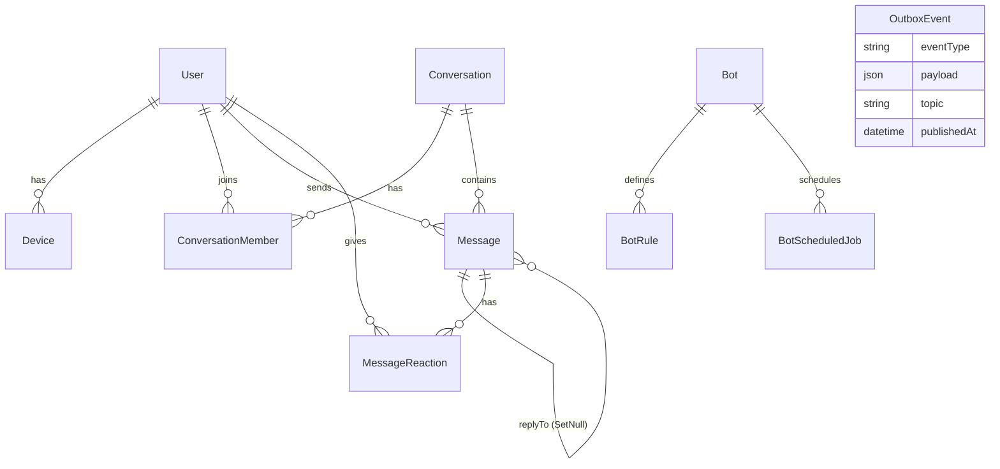

### 8.3 Migrations & seed

- **4 migrations:** init (295 dòng, 13 table/14 FK) → `direct_pair_key` (+UNIQUE, comment "duplicate pairs → UNIQUE FAILS LOUDLY") → `conversation_tombstone` (deletedAt/deletedBy) → `direct_pair_key_backfill` (heal legacy NULL).
- **Seed:** 5 users (`duong`, `alice`, `bob`, `john`, `system-bot`), 2 group ("General" do duong tạo, "Random" do alice), 2 DM, bot join 2 group, **11 bot rules** (welcome-greeting, cmd-ping/help/status/users/stats/room, reaction-nice, delayed-response, intro-start/capture). Không seed message nào.
- **Test DB `mqtt_chat_test`:** tạo qua `docker exec psql CREATE DATABASE` idempotent; migrate+seed riêng với env override; **2 lớp guard** từ chối dev DB trong orchestrator `scripts/test-stack.mjs:41-63` (+ escape hatch `ALLOW_UNSAFE_TEST_DB=1`).

Source: `packages/database/prisma/schema.prisma`, `prisma/migrations/*`, `src/seed.ts`, `scripts/test-stack.mjs`

---

## 9. Contract Architecture

### 9.1 Contract là gì?

Contract là **"hợp đồng dữ liệu"**: bản mô tả chính xác hình dạng thông điệp mà các thành phần trao đổi cho nhau. Ai phát và ai tiêu thụ đều đọc cùng một bản hợp đồng — được validate bằng Zod tại mọi biên giới:

```text
Producer (web/bot/API)                      Consumer (chat-worker/notification…)
      │                                              ▲
      │  build envelope theo schema                  │ parse + validate lại
      ▼                                              │
   MQTT topic ─────────────────────────────► COMMAND_SCHEMAS / EVENT_SCHEMAS
                packages/mqtt-contracts = nơi duy nhất định nghĩa topic + schema
```

Lợi ích thực tế trong repo này: thêm field mới kèm `.default()` ⇒ consumer cũ vẫn chạy (backward-compat trên wire); đổi topic version = đổi namespace `chat/v1`; E2E test dùng namespace riêng `chat/v1-e2e` để không đụng dev traffic.

### 9.2 Envelope (vỏ bọc) chuẩn

Mọi event canonical được bọc trong envelope có version:

```ts
// Event envelope — packages/mqtt-contracts/src/envelope.ts:50-74
{
  eventId: string          // UUID, để consumer dedup redelivery
  eventType: string        // "message.created", "conversation.deleted"…
  version: number          // schema version (hiện luôn = 1)
  timestamp: string        // ISO 8601
  actor?: { userId?, deviceId?, botId? }
  conversationId?: string
  origin: { type: "user"|"bot"|"system", id?, ruleId? }   // phục vụ loop-prevention bot
  correlationId?: string   // gốc của chuỗi trace
  causationId?: string     // eventId gây ra event này
  data: T                  // payload riêng từng loại event
}

// Command envelope khác ở vài điểm (envelope.ts:24-47):
{ requestId, commandType, version, timestamp, actor, clientMessageId?,
  correlationId?, causationId?, data }
```

### 9.3 Bảng contract Producer → Consumer

| Contract / Event                                         | Producer                                           | Consumer                                    | Transport           | Purpose                        |
| -------------------------------------------------------- | -------------------------------------------------- | ------------------------------------------- | ------------------- | ------------------------------ |
| `message.send` command                                   | Web/Mobile (realtime-core helpers), scripts        | chat-worker                                 | MQTT QoS1           | Gửi tin                        |
| `message.edit` / `message.delete`                        | Web/Mobile                                         | chat-worker                                 | QoS1                | Sửa/xoá tin (soft)             |
| `reaction.add` / `reaction.remove`                       | Web/Mobile/**bot-worker** (auto-react 👍)          | chat-worker                                 | QoS1                | Thêm/bỏ reaction               |
| `receipt.read` / `receipt.delivered`                     | Web (chỉ read); delivered **không client nào gọi** | chat-worker                                 | QoS1                | Watermark đã đọc/nhận          |
| `typing.set`                                             | Web/Mobile (throttle)                              | chat-worker                                 | QoS0 (web chủ động) | Đang gõ                        |
| `presence.set`                                           | Web/Mobile onConnect/onDisconnect + **LWT**        | chat-worker                                 | QoS1                | Online/offline                 |
| `bot.send`                                               | bot-worker                                         | chat-worker (`handlers/bot-send.ts`)        | QoS1                | Bot gửi tin qua pipeline chuẩn |
| `message.created`                                        | chat-worker (outbox; user msg + bot msg)           | mọi client, bot-worker, notification-worker | QoS1                | Fact: tin nhắn chính thức      |
| `message.edited` / `message.deleted`                     | chat-worker (outbox)                               | clients, bot-worker                         | QoS1                | Fact sửa/xoá                   |
| `message.rejected`                                       | chat-worker (**direct**, không outbox)             | client gốc (fail optimistic UI ngay)        | QoS1                | Từ chối command send           |
| `reaction.added` / `removed`                             | chat-worker (outbox)                               | clients, bot-worker                         | QoS1                | Fact reaction                  |
| `receipt.read/delivered` events                          | chat-worker (outbox)                               | chủ conversation qua per-user topic         | QoS1                | Cập nhật ticks người gửi       |
| `typing.started/stopped`                                 | chat-worker (direct, ephemeral)                    | clients                                     | **QoS0**            | Hiện "đang gõ"                 |
| `presence.online/offline`                                | chat-worker (outbox)                               | clients, bot-worker                         | QoS1                | Dot online/offline             |
| `conversation.created/deleted/member-joined/member-left` | **API** ghi outbox cùng tx; chat-worker drain      | clients (discovery realtime!), bot-worker   | QoS1                | Lifecycle nhóm/DM              |
| `bots/{botId}/events`                                    | bot-worker rule action `publish_event`             | (không ai subscribe trong source)           | QoS0                | Observability free-form        |

### 9.4 Structure rút gọn các contract trọng yếu

```ts
// sendMessageCommandSchema — commands.ts:8-21
{
  conversationId: string,       // bắt buộc
  clientMessageId: string,      // UUID phía client — chìa khoá idempotency
  type: "TEXT"|"IMAGE"|"VIDEO"|"FILE"|"VOICE",
  content: string,              // ≤10_000 ký tự; TEXT phải non-empty
  replyToId: string | null,
  metadata: Record<string, unknown> | null,   // media: {storageKey, filename, mimeType, size}
}

// messageEventDataSchema (data của message.created) — events.ts:8-27
{
  messageId, clientMessageId, conversationId,
  senderId, senderType: "USER"|"BOT"|"SYSTEM",
  sequence: number > 0,         // thứ tự chính thức trong conversation
  type, content,
  replyToId: string|null,
  metadata: object|null,
  reactions: [{emoji, userId}], // default [] — backward-compat
  createdAt                     // ISO
}

// receipt.read — events.ts:95-101 (watermark, KHÔNG per-message row)
{ conversationId, userId, lastReadSequence: number }

// conversation.deleted — events.ts:55-62 (tombstone snapshot)
{ id, title|null, deletedBy, deletedAt, lastSequence, memberIds: [...] }
```

### 9.5 Versioning strategy

- Envelope mang `version: number` nhưng hiện luôn hardcode `1` (`index.ts:22,45`) — chưa có v2, chưa có migration path, chưa có schema registry.
- Version thật sự nằm ở **namespace topic** `chat/v1` — nâng cấp breaking = đổi namespace; override bằng env `MQTT_TOPIC_NAMESPACE` (dùng làm fence cho E2E stack).
- Backward-compat trên wire dùng zod `.default()` (vd `reactions` default `[]`).
- Lưu ý kiểm chứng: map `EVENT_SCHEMAS` có 15 entry nhưng **thiếu `receipt.delivered`** dù eventType này được publish thật; consumers hiện không dùng map này để validate data (chỉ validate envelope) nên chưa gây lỗi.

Source: `packages/mqtt-contracts/src/{envelope,commands,events,topics,qos,media}.ts`

---

## 10. MQTT Topic Architecture

### 10.1 Naming convention

```text
{namespace}/{class}/{domain}/{verb}
   chat/v1   commands  message  send          ← imperative cho lệnh
             events    message  created        ← past tense cho fact
             users/{userId}/events/receipt/read     ← fan-out cá nhân hoá
             bots/{botId}/events                   ← observability
```

- Namespace mặc định `chat/v1`, override bằng env `MQTT_TOPIC_NAMESPACE` (E2E fence `chat/v1-e2e`).
- Toàn bộ topic string sống ở **một file**: `packages/mqtt-contracts/src/topics.ts` — cấm hardcode nơi khác.
- CommandType/eventType dạng dotted (`"message.send"` ↔ topic `commands/message/send`) map bằng bảng `COMMAND_TYPE_TO_TOPIC`.

### 10.2 Topic tree (từ code)

```text
chat/v1
├── commands/
│   ├── message/{send, edit, delete}
│   ├── reaction/{add, remove}
│   ├── receipt/{read, delivered}
│   ├── typing/set
│   ├── presence/set            ← cũng là will-topic (LWT) của web/mobile
│   └── bot/send
├── events/
│   ├── message/{created, edited, deleted, rejected}
│   ├── reaction/{added, removed}
│   ├── typing/{started, stopped}          (QoS 0)
│   ├── presence/{online, offline}
│   ├── conversation/{created, deleted, member-joined, member-left}
│   ├── conversation/updated               ⚠ define-only — không ai publish
│   ├── media/uploaded                     ⚠ define-only
│   ├── system/error                       ⚠ define-only
│   └── receipt/{read, delivered}          ⚠ dead constants — thực tế chạy per-user
├── users/{userId}/events/receipt/{read, delivered}   ← topic THẬT của receipts
├── conversations/{id}/events/{suffix}     builder tồn tại, 0 caller
└── bots/{botId}/events                    rule action publish_event (QoS 0)
```

### 10.3 Bảng topic · publisher · subscriber · payload · QoS

**Commands (client/bot → chat-worker):**

| Topic                           | Publisher                               | Subscriber                       | Payload                   | QoS                        |
| ------------------------------- | --------------------------------------- | -------------------------------- | ------------------------- | -------------------------- |
| `chat/v1/commands/message/send` | Web+Mobile `sendMessage`                | `$share/chat-workers/commands/#` | sendMessageCommand        | 1                          |
| `.../message/edit` · `/delete`  | Web+Mobile                              | như trên                         | edit/deleteMessageCommand | 1                          |
| `.../reaction/add` · `/remove`  | Web+Mobile, bot-worker                  | như trên                         | addReactionCommand        | 1                          |
| `.../receipt/read`              | Web (khi stick-to-bottom)               | như trên                         | readReceiptCommand        | 1                          |
| `.../receipt/delivered`         | _(không client nào gọi)_                | như trên                         | deliveredReceiptCommand   | 1                          |
| `.../typing/set`                | Web+Mobile throttle                     | như trên                         | typingSetCommand          | 0 (web) / 1 (core default) |
| `.../presence/set`              | Web+Mobile connect/disconnect + **LWT** | như trên                         | presenceSetCommand        | 1                          |
| `.../bot/send`                  | bot-worker                              | như trên                         | botSendCommand            | 1                          |

**Events (chat-worker → mọi bên):**

| Topic                                                                          | Cơ chế                         | QoS   | Payload                                                               |
| ------------------------------------------------------------------------------ | ------------------------------ | ----- | --------------------------------------------------------------------- |
| `events/message/created`                                                       | outbox                         | 1     | messageEventData (sequence!)                                          |
| `events/message/edited` · `/deleted`                                           | outbox                         | 1     | messageId + content/deletedAt                                         |
| `events/message/rejected`                                                      | **direct**                     | 1     | clientMessageId + reason                                              |
| `events/reaction/added` · `/removed`                                           | outbox                         | 1     | messageId + emoji + userId                                            |
| `users/{uid}/events/receipt/read` · `/delivered`                               | outbox (1 row mỗi member khác) | 1     | watermark                                                             |
| `events/typing/started` · `/stopped`                                           | **direct, ephemeral**          | **0** | conversationId + userId                                               |
| `events/presence/online` · `/offline`                                          | outbox                         | 1     | userId + deviceId + connectionCount                                   |
| `events/conversation/created` · `/deleted` · `/member-joined` · `/member-left` | outbox (do API ghi)            | 1     | conversation summary (+addedUserIds/removedUserId/memberIds snapshot) |
| `bots/{botId}/events`                                                          | direct                         | 0     | free-form JSON                                                        |

**Subscriber matrix:**

| Consumer                   | Pattern                                                      | QoS              |
| -------------------------- | ------------------------------------------------------------ | ---------------- |
| chat-worker                | `$share/chat-workers/chat/v1/commands/#`                     | 1 (deferred-ack) |
| bot-worker                 | `$share/bot-workers/chat/v1/events/#`                        | 1                |
| notification-worker        | `$share/notification-workers/chat/v1/events/message/created` | 1                |
| Web/Mobile user            | `chat/v1/events/#` + `chat/v1/users/{id}/events/#`           | 1                |
| Admin dashboard (observer) | `chat/v1/events/#`                                           | 1                |

### 10.4 QoS matrix & lý do

| Luồng                               | QoS | Vì sao                                                        |
| ----------------------------------- | --- | ------------------------------------------------------------- |
| Mọi command (trừ typing do web gửi) | 1   | at-least-once; trùng được dedup bởi clientMessageId/watermark |
| Event durable (qua outbox)          | 1   | consumers phải idempotent theo eventId/id-upsert              |
| typing.*                            | 0   | mất chấp nhận được; client bù bằng TTL sweep 8s               |
| message.rejected                    | 1   | optimistic UI cần fail deterministic                          |
| bots observability                  | 0   | log-only                                                      |
| QoS 2                               | —   | cố tình tránh (overhead)                                      |

### 10.5 Retained / Last Will / Session

| Tính năng          | Trạng thái trong hệ thống                                                                                                                                          |
| ------------------ | ------------------------------------------------------------------------------------------------------------------------------------------------------------------ |
| Retained           | ❌ Không dùng đâu cả                                                                                                                                               |
| Last Will          | ✅ Web + mobile: will = command envelope `presence.set {isOnline:false}` QoS1 retain:false — broker tự báo offline khi client chết kết nối. Workers không đặt will |
| Persistent session | ❌ `clean:true` luôn; clientId có nonce `${Date.now()}` chống takeover giữa các tab                                                                                |
| Wildcard           | `#`: 4 ngữ cảnh; `+`: không dùng                                                                                                                                   |
| EMQX ACL/auth      | ❌ Không cấu hình — anonymous intentional (docker-compose.yml:39-40)                                                                                               |

Source: `packages/mqtt-contracts/src/topics.ts`, `qos.ts`, `apps/chat-worker/src/index.ts:56`, `apps/web/src/lib/realtime-service.ts:89-104`
---

# PHẦN V — LUỒNG TIN NHẮN & CÁC LUỒNG NGHIỆP VỤ

## 11. End-to-End Message Flow: User A → User B

_Trace bằng code thực tế — đây là luồng quan trọng nhất của hệ thống._

### 11.1 17 bước từ lúc bấm Send

```text
 [CLIENT A - web/mobile]
 1. User nhập text, bấm Send                        Composer.tsx:131-137
 2. clientMessageId = crypto.randomUUID()           Composer.tsx:138
 3. Optimistic UI: thêm bubble trạng thái "pending"  Composer.tsx:49-58
    (nếu offline → "queued", chờ reconnect)
 4. Publish command lên MQTT QoS1:                   realtime-core sendMessage :433-442
    topic chat/v1/commands/message/send
    envelope {requestId, actor:{userId,deviceId}, data:{conversationId,
              clientMessageId, type:"TEXT", content, replyToId}}
    + arm timeout 10s → quá hạn đánh dấu failed      Composer.tsx:8-26

 [BROKER]
 5. EMQX nhận, route tới DUY NHẤT 1 chat-worker     $share/chat-workers/commands/#

 [CHAT-WORKER]
 6. Parse JSON + validate envelope + zod data       worker.ts:92-117
 7. Check membership của sender A                   messages.ts:91-97
 8. Check conversation chưa tombstone               messages.ts:100-107
 9. Validate replyToId (tồn tại + cùng conv)        messages.ts:111-117
    └─ fail bất kỳ bước 7-9 → publish message.rejected về A
       (clientMessageId + reason) → A fail bubble NGAY   messages.ts:54-77
10. TRANSACTION PostgreSQL (ReadCommitted):
      seq = UPDATE Conversation SET lastSequence=lastSequence+1 RETURNING  :124-132
      INSERT Message (id, sequence=seq, content, senderType USER…)         :134-146
      INSERT OutboxEvent (message.created, topic events/message/created)   :157-165
11. PUBACK cho broker (sau commit — crash-safe)     packages/mqtt deferred-ack
12. Redis: tăng unread counter cho member khác      messages.ts:172-181

 [OUTBOX PUBLISHER - trong chat-worker]
13. Poll 500ms → SELECT … FOR UPDATE SKIP LOCKED batch 50   outbox.ts:71-77
14. Publish event canonical QoS1 lên events/message/created :84-91
15. Mark outbox row publishedAt                     outbox.ts:84-91

 [CLIENT B + hệ sinh thái]
16. B nhận event → normalizeMessage → upsert theo messageId
    → nếu B đang mở conv: render; sort theo sequence        page.tsx:362-394
17. Song song:
    • bot-worker nhận event → rule/command engine → có thể trả lời
      bằng bot.send (đi lại đúng pipeline này)              rule-engine.ts
    • notification-worker nhận event → B offline? → push console
      + audit Redis TTL 600s                                notification index.ts:65-93
```

### 11.2 Vòng đóng lại phía Client A

```text
A cũng subscribe events/# nên NHẬN LẠI chính tin mình gửi:
  message.created (khớp clientMessageId) → pending → "sent" ✓
B đọc tin (stick-to-bottom) → publish receipt.read {lastReadSequence}
  (lastReadSequence = "watermark" — mốc đã đọc cao nhất, chi tiết §21)
chat-worker update watermark → outbox receipt.read PER-USER topic cho A
A nhận receipt.read → tick chuyển "read" ✓✓                    (§21)
```

### 11.3 Sequence diagram

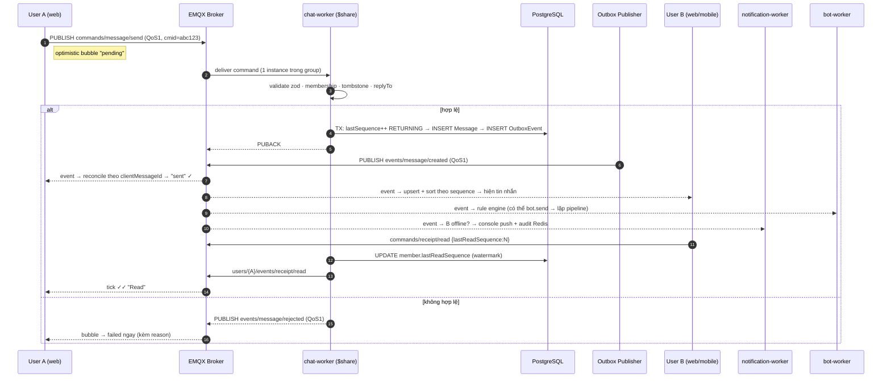

### 11.4 Offline / reconnect sync

```text
mất kết nối → mqtt.js auto-reconnect mỗi 2000ms
  ↓ tin nhắn gửi trong lúc offline → status "queued" (timeout 30s web / 10s mobile)
reconnect thành công ('connect' event):
  ↓ restoreSubscriptions() đăng ký lại mọi pattern          realtime-core:335-352
  ↓ flush queued sends (giữ NGUYÊN clientMessageId)         page.tsx:279-286
  ↓ recoverAfterReconnect(): refetch conversations +
    GET /conversations/:id/messages?after=<watermark>&limit=100
    merge by id (watermark=0 → latest 50 REPLACE)           page.tsx:503-533
resume realtime — event nhảy sequence hở ga → gap recovery (§14)
```

Source: `apps/web/src/components/Composer.tsx`, `apps/chat-worker/src/{worker,handlers/messages,outbox}.ts`, `docs/message-flow.md`

---

## 12. Message State Machine

Trạng thái mà **client hiển thị** cho tin nhắn của chính mình (server không lưu trạng thái này — server chỉ lưu dữ liệu cuối cùng):

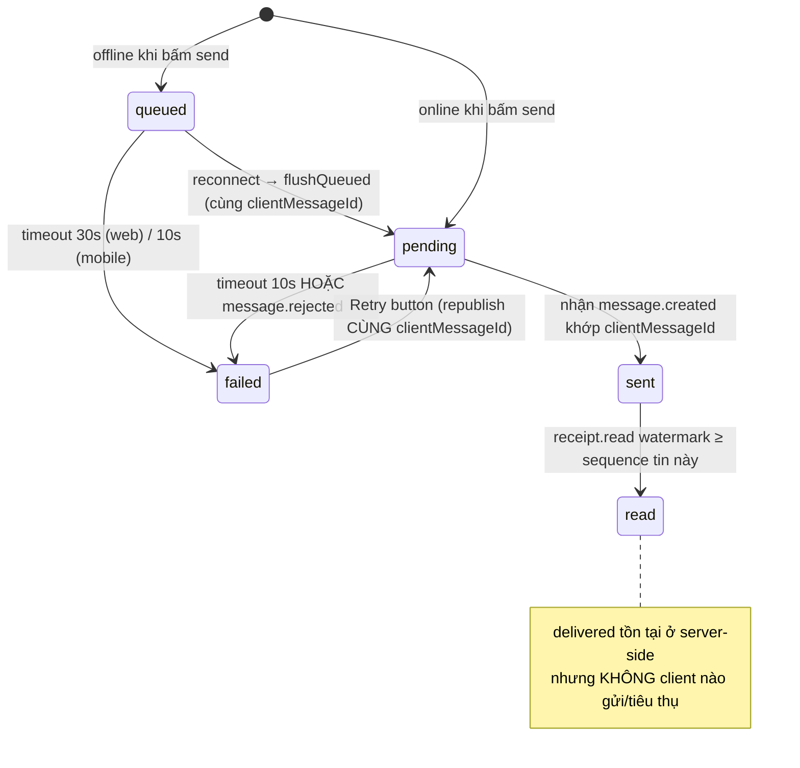

| Trạng thái | Ai quyết định                          | Event làm thay đổi                        | UI lấy từ đâu                       |
| ---------- | -------------------------------------- | ----------------------------------------- | ----------------------------------- |
| `queued`   | client (connectionState ≠ connected)   | transition → connected                    | `pendingMessages[].status`          |
| `pending`  | client ngay khi bấm Send               | —                                         | zustand `pendingMessages`           |
| `sent`     | server (qua event)                     | `message.created` match `clientMessageId` | store `resolvePending`              |
| `failed`   | client timeout hoặc `message.rejected` | timeout timer / rejected event            | `markPendingFailed`                 |
| `read`     | server (receipt event)                 | `receipt.read` (per-user topic)           | `member.lastReadSequence` watermark |

- Tick hiển thị: `✓` = Sent, `✓✓` = Read — **binary**, không có tick riêng cho delivered (`MessageBubble.tsx:280-288`).
- Tin bị xoá (soft delete): render italic mờ "Message deleted"; tin đã sửa: label "edited".
- Server-side các trạng thái vật lý là watermark trên `ConversationMember`: `lastDeliveredSequence`, `lastReadSequence`.

---

## 13. `clientMessageId` & Idempotency

**`clientMessageId` là gì:** UUID do **client sinh** trước khi gửi (`crypto.randomUUID()` web — `Composer.tsx:138`; `safeUuid()` fallback trên Hermes). Nó đi kèm command, được persist vào cột `Message.clientMessageId` với **UNIQUE constraint global** (schema.prisma:91).

**Tại sao cần:** MQTT QoS1 = at-least-once ⇒ broker có thể giao cùng một command nhiều lần; client retry cũng gửi lại y nguyên. Không có định danh ổn định thì mỗi lần retry tạo một tin mới.

**Ví dụ end-to-end theo code thật:**

```text
Client gửi:  clientMessageId = abc123
             → mạng rớt trước/nhận sau khi xử lý → không thấy PUBACK/event

Client retry (Retry button hoặc flush queue): VẪN clientMessageId = abc123
             Composer.tsx:73-80 (retryPendingMessage), republishPayload giữ nguyên data

Server nhận lần 2:
  → INSERT Message vi phạm UNIQUE(clientMessageId)
  → Prisma throw P2002                                    messages.ts:190-207
  → tìm Message theo clientMessageId, cùng conversation?
       CÓ  → log "message.send deduplicated", ack im lặng
             (KHÔNG phát thêm message.created — client đã có tin rồi)
       KHÔNG (collision khác conversation — cực hiếm) → throw → redelivery loop ⚠
```

- **DB constraint:** `Message_clientMessageId_key` UNIQUE 1 cột (global, KHÔNG phải per-conversation như docs mô tả — xem Phụ lục A). Kèm lưới an toàn thứ hai `UNIQUE(conversationId, sequence)`.
- **Worker dedup:** catch-P2002 như trên; `bot.send` tương tự (`bot-send.ts:117-127`).
- **Event-side dedup:** event mang `eventId`; consumers idempotent (web upsert-by-id, reaction target-state no-op, receipt watermark monotonic) dù web không tra eventId tường minh.
- **Redis không tham gia dedup message** — chỉ presence/typing/unread/bot.

---

## 14. Message Ordering / Sequence

**Cấp số ở đâu:** bên trong chat-worker, trong cùng transaction ghi Message:

```sql
UPDATE "Conversation"
SET    "lastSequence" = "lastSequence" + 1,
       "updatedAt" = NOW()
WHERE  id = $1
RETURNING "lastSequence";            -- apps/chat-worker/src/handlers/messages.ts:124-132
```

**Vì sao không race:** câu UPDATE lấy row-lock trên Conversation đến tận commit ⇒ hai transaction gửi đồng thời bị tuần tự hoá; unique `(conversationId, sequence)` là lưới an toàn thứ hai. Không bao giờ dùng `SELECT MAX(sequence)+1` (đọc-stale).

**Ví dụ:**

```text
Conversation 100:  lastSequence = 100
Msg A (tx1) → seq 101   Msg B (tx2) → seq 102   Msg C (tx3) → seq 103
```

**Client sort thế nào:** mọi list tin sort ASC theo `sequence` (KHÔNG phải createdAt) — `chat-store.ts:139-140`, mobile `useChatSession.ts:280`. `applyMessageActivity` đảm bảo `lastSequence` không bao giờ giảm (monotonic guard chống event cũ đến sau).

**Gap detection:** web đọc watermark TRƯỚC khi advance; nếu `sequence > lastKnown + 1` → `recoverSequenceGap()` gọi `GET /messages?after=<lastKnown>&limit=100` merge by id (guard Set chống re-entry) — `page.tsx:370-390, 474-501`. **Mobile không có gap-detection chủ động** (chỉ heal khi reconnect).

**Reconnect dùng sequence:** có — `after=<watermark>` cursor pagination (limit clamp 1..100, `hasMore = len == limit`). Load lịch sử ngược: `before=<oldest.sequence>`.

---

## 15. Reply Flow

```text
Message B (reply)
 └── replyToId ──► Message A (target, FK self-relation onDelete SetNull)
```

| Giai đoạn              | Hành vi                                                                                                                                                     | Source                                              |
| ---------------------- | ----------------------------------------------------------------------------------------------------------------------------------------------------------- | --------------------------------------------------- |
| Client gửi             | composer giữ replyTo state → command mang `replyToId` = **canonical messageId**                                                                             | `Composer.tsx:141-144`                              |
| Contract               | `replyToId: string.min(1).nullable().default(null)`                                                                                                         | commands.ts:14                                      |
| Validation worker      | target phải **tồn tại** VÀ `replyTo.conversationId === data.conversationId` — sai → reject `message.rejected` reason "invalid reply target"                 | `messages.ts:111-117`                               |
| Rejection rules đầy đủ | thiếu actor userId; non-member; conversation tombstoned; reply target không tồn tại; reply target khác conversation                                         | `messages.ts:85-117`                                |
| KHÔNG bị chặn          | reply vào tin đã soft-delete (vẫn hợp lệ); self-reply; chuỗi reply dài (chỉ lưu 1 cấp)                                                                      | —                                                   |
| Canonical event        | `message.created.data.replyToId` nullable                                                                                                                   | events.ts:17                                        |
| Persist                | FK `replyToId → Message` với `onDelete SetNull` — xoá target không mất reply                                                                                | schema.prisma:106                                   |
| UI                     | banner "Replying to X" (ẩn nếu target deleted); bubble quote accent-line; fallback "Original message unavailable" nếu target ngoài cache (không fetch thêm) | `Composer.tsx:183-205`, `MessageBubble.tsx:202-213` |
| Test phủ               | invalid target → nhận `message.rejected` <5s, không có `message.created`                                                                                    | `scripts/media-reply-e2e.mts:213-244`               |

---

## 16. Media / Attachment Flow

Hỗ trợ: **image/jpeg, image/png, image/gif, image/webp, video/mp4, video/webm, audio/webm, audio/mpeg, application/pdf** (9 MIME chuẩn — media.ts:15-25; alias `image/jpg/pjpeg/pipeg→jpeg`; HEIC cố tình bị chặn; fallback theo extension).

```text
Select file (web: input+paste-image · mobile: image/document picker)
→ [mobile only] validate MIME qua contracts + cap 50MB + HEIC error riêng
→ POST /api/uploads (multipart, qua gateway same-origin)
     Multer memoryStorage, limits.fileSize = 50 MB (quá → 413)
     MIME allowlist check → sai: 400 UNSUPPORTED_MEDIA_TYPE (+ danh sách supported)
     conversation phải tồn tại → 400 CONVERSATION_NOT_FOUND (không check membership!)
     PutObject MinIO bucket mqtt-chat-media
     key = media/{conversationId}/{Date.now()}-{sanitizedName}   (pattern-guard traversal)
→ response {key, filename, mimeType(canonical), size}   ← KHÔNG ghi bảng nào
→ client publish message.send type IMAGE|FILE
     metadata = {storageKey, filename, mimeType, size}    ← binary KHÔNG qua MQTT
→ chat-worker pipeline chuẩn → message.created
→ recipient render: 
     GET /api/media stream server-side, Cache-Control private immutable 1 năm
```

- **Failure handling:** MIME sai → 400 deterministic; storage down lúc upload → 500 INTERNAL_ERROR; storage down lúc đọc → 404 MEDIA_NOT_FOUND (kể cả lỗi tạm thời); lỗi giữa stream → response đứt, process không crash.
- **Security:** key pattern chặn path-traversal; stream qua API (object private); không magic-byte sniffing (tin Content-Type client khai).
- **Điểm lưu ý:** upload không ghi DB ⇒ object mồ côi nếu user không gửi message tiếp; web không validate size/MIME client-side (upload xong mới biết lỗi).

Source: `apps/api/src/controllers/uploads.controller.ts`, `media.controller.ts`, `packages/storage/src/index.ts`, `packages/mqtt-contracts/src/media.ts`
---

# PHẦN VI — LIFECYCLE & REALTIME SOCIAL

## 17. Group Lifecycle

**Điểm thiết kế quan trọng:** toàn bộ group lifecycle đi qua **REST API** (không có MQTT command nào cho group) — mutation ghi DB + outbox event trong cùng transaction; client cập nhật realtime nhờ event. Role chỉ có **MEMBER | ADMIN** (không có OWNER); creator mặc định thành ADMIN.

### Create group

```text
POST /api/conversations  {type:"GROUP", title ≤100, createdBy, memberIds 2..50}
→ validate: user tồn tại (404), không trùng id (400), createdBy ∈ memberIds (400)
→ TX: INSERT Conversation + members (creator = ADMIN)
     + outbox conversation.created
→ mọi member đang online nhận event → upsert list NGAY (không reload)
```

### Add / remove member · leave · delete

| Action              | Endpoint                                           | Guard                                                                       | DB                                                                    | Event                                                        |
| ------------------- | -------------------------------------------------- | --------------------------------------------------------------------------- | --------------------------------------------------------------------- | ------------------------------------------------------------ |
| Add members         | `POST /conversations/:id/members?actor=`           | ADMIN + GROUP-only; tombstoned →404; unknown →404                           | createMany skipDuplicates                                             | `conversation.member-joined` (+addedUserIds)                 |
| Remove other        | `DELETE /conversations/:id/members/:userId?actor=` | ADMIN (self-leave thì ai cũng được)                                         | deleteMany                                                            | `conversation.member-left`                                   |
| Leave (self)        | như trên với `:userId` = mình                      | mọi member                                                                  | deleteMany                                                            | `conversation.member-left`                                   |
| Sole-admin rời nhóm | —                                                  | tự động promote human cũ nhất thành ADMIN (cùng tx)                         | member.update                                                         | như trên                                                     |
| Member cuối rời     | —                                                  | chặn 400                                                                    | —                                                                     | —                                                            |
| Delete group        | `DELETE /conversations/:id?actor=`                 | ADMIN của GROUP (DIRECT → 400); đã xoá → idempotent `{deleted:true,absent}` | **tombstone**: set deletedAt/deletedBy (KHÔNG xoá messages/reactions) | `conversation.deleted` (kèm `memberIds` snapshot pre-delete) |

**Tombstone semantics:** soft-delete. Sau khi xoá:

- List client loại conversation khỏi sidebar (`page.tsx:406-417`);
- `GET /conversations/:id` → 404;
- Gửi tin → chat-worker reject "conversation was deleted" (`messages.ts:100-107`) → `message.rejected`;
- **Lịch sử vật lý vẫn còn** — và `GET /conversations/:id/messages` hiện không filter tombstone cũng như không check membership (risk §37).

**Permission matrix:**

| Action                 | MEMBER               | ADMIN | Check tại                                                           |
| ---------------------- | -------------------- | ----- | ------------------------------------------------------------------- |
| Tạo group              | ✅ (trở thành ADMIN) | —     | chat.controller.ts:253                                              |
| Add member             | ❌ 403               | ✅    | :526-529                                                            |
| Remove người khác      | ❌ 403               | ✅    | :595-599                                                            |
| Leave                  | ✅                   | ✅    | :595                                                                |
| Rename group           | —                    | —     | **feature chưa tồn tại** (topic `conversation.updated` define-only) |
| Delete group           | ❌ 403               | ✅    | :176-181                                                            |
| Xoá message người khác | ❌                   | ✅    | worker `messages.ts:287-295`                                        |

Test phủ: `scripts/group-lifecycle-e2e.mts` — non-admin thao tác →403, ghost add →404, leave DIRECT/last-member →400, sole-admin promotion, send-sau-delete → rejected, history không bị phá.

---

## 18. Conversation Lifecycle

```text
CREATE ──► DISCOVER ──► LOAD ──► SYNC (realtime + backfill) ──► UPDATE ──► DELETE (tombstone)
```

- **Create DIRECT (DM):** uniqueness qua cột `directPairKey` = `sort(a,b).join(":")` UNIQUE (schema.prisma:45). Flow: lookup-first theo pair key (fast path + heal membership thiếu nếu cần) → thấy legacy row NULL-key thì adopt+stamp → race 2 request tạo đồng thời: thua cuộc bắt P2002 và reuse winner ⇒ luôn đúng 1 DM cho một cặp. Self-chat bị chặn (`a===b` → 400). E2E xác minh bằng cách tạo CONCURRENT cả hai chiều A→B và B→A.
- **Discover:** `GET /users` (orderBy createdAt, exclude `system-bot*`); `GET /conversations?userId=` (filter membership + `deletedAt:null`, orderBy updatedAt desc, kèm last-message preview). Realtime discovery: `conversation.created` event đến là list tự thêm mới.
- **Load:** bootstrap song song users + conversations; mở conversation → latest 50 (`limit` clamp 1..100); "Load earlier" → `before=<oldest.sequence>` prepend có anchor giữ vị trí scroll (§29).
- **Sync/reconnect:** xem §11.4 — resubscribe + flush queue + heal `after=<watermark>`.
- **Delete:** chỉ GROUP có tombstone (§17). DM không thể "xoá" (chỉ rời/thoát phía client).
- **Edit/Delete/Reaction message:** đều là MQTT command qua worker (bảng ở §7.3): edit = author-only + set editedAt (không tăng sequence); delete = author hoặc ADMIN, soft-delete `deletedAt + content=""`; reaction = upsert composite PK.

Source: `apps/api/src/controllers/chat.controller.ts:253-476`, `packages/database/src/index.ts:49-54`, `scripts/duplicate-direct-e2e.mjs`

---

## 19. Presence (Online/Offline)

```text
client connect MQTT
  ↓ onConnect → publish presence.set {isOnline:true} (QoS1)
chat-worker:
  SADD presence:user:{uid} {deviceId}
  SET connection:user:{uid}:{did} timestamp      (không TTL!)
  Device.upsert clientId={uid}:{did}, platform="web"
  outbox presence.online {connectionCount}
  ↓
heartbeat = chính keepalive MQTT 30s (không có ping app-level riêng)
  ↓
disconnect sạch: client gửi isOnline:false trước khi end
disconnect đột ngột: broker phát LWT = command presence.set{isOnline:false}
chat-worker offline path:
  SREM … ; nếu set RỖNG → SET presence:lastseen:{uid} + DEL set → outbox presence.offline
```

- **Source of truth:** Redis set `presence:user:{userId}` (danh sách deviceId). User offline ⇔ set rỗng (`SCARD == 0`).
- **Multiple devices:** connectionCount = số phần tử set; destroy device A khi còn device B ⇒ user VẪN online (E2E `presence-e2e.mjs` verify đúng kịch bản này — no false-offline).
- **lastSeen:** Redis key `presence:lastseen:{uid}` (ISO string). REST `/api/presence` KHÔNG trả lastSeenAt; chỉ admin dashboard thấy qua `Device.lastSeenAt` (Postgres).
- **UI:** snapshot đầu từ REST rồi cập nhật theo event; grace 10s chống flicker LWT (`PRESENCE_GRACE_MS`).
- ⚠ Connection keys không TTL/lease: nếu LWT cũng thất bại (mất mạng 2 chiều), device kẹt trong set ⇒ user "online ma". Đã đánh giá ở §37.

---

## 20. Typing Indicator

| Hạng mục         | Thực tế                                                                                                                                                                               |
| ---------------- | ------------------------------------------------------------------------------------------------------------------------------------------------------------------------------------- |
| Command          | `typing.set {conversationId, isTyping}` — membership guard                                                                                                                            |
| Client throttle  | web: start tối đa 1 lần/giây, auto-stop sau 2s idle, stop ngay khi send; mobile: throttle 1s + autostop 2s                                                                            |
| Server state     | Redis `SET typing:conversation:{cid}:user:{uid} "1" EX 8` / DEL — **ephemeral hoàn toàn**, không Prisma                                                                               |
| Event            | `typing.started/stopped {conversationId, userId}` — **publish TRỰC TIẾP QoS0** (không outbox, không persist)                                                                          |
| Consumer timeout | web stamp timestamp mỗi `started`, sweep mỗi 2000ms xoá entry cũ hơn 8000ms (chống kẹt do mất frame QoS0); mobile tương tự                                                            |
| Self-exclusion   | không render typing của chính mình                                                                                                                                                    |
| Lưu ý            | nếu frame `stopped` bị mất, Redis key tự hết hạn sau 8s nhưng **không ai sinh `typing.stopped` từ expiry** (keyspace notification không dùng) — client bù bằng TTL sweep của chính nó |

Source: `apps/chat-worker/src/handlers/typing.ts`, `packages/redis/src/index.ts:90-103`, `apps/web/src/components/Composer.tsx:115-133`, `apps/web/src/store/chat-store.ts:468-490`

---

## 21. Read / Delivery Receipts

**Model:** watermark per-member — `ConversationMember.lastReadSequence`, `lastDeliveredSequence` (Int default 0). Không có bảng per-message read rows ⇒ chi phí O(1) mỗi lần đọc.

**Subset thực tế end-to-end: `sent → read`.** `receipt.delivered` là _half-implemented_: đủ command schema + handler + watermark + event topic phía server, nhưng **không client nào gọi `markDelivered` và không UI nào tiêu thụ** delivered event.

```text
[READ]
B đang stick-to-bottom & watermark tăng → publish receipt.read {lastReadSequence: seq tin cuối}
  (MessageList.tsx:236-247 — guard chống spam khi edits/reactions đổi array)
chat-worker: guard stale (≤ watermark hiện tại → return, idempotent)
  → UPDATE member.lastReadSequence
  → reset Redis unread counter
  → outbox receipt.read CHO TỪNG member khác → per-user topic
A nhận → applyReadReceipt → readWatermark = MAX(lastReadSequence of OTHERS)
  → tick ✓✓ cho mọi tin sequence ≤ watermark
multi-device: watermark max tự nhiên hợp nhất nhiều device
[DELIVERED] server-side đầy đủ nhưng dead-end cả 2 phía client (đánh giá §37 P3)
```

---

## 22. Notification Flow

```text
                    message.created (canonical event)
                          │
            ┌─────────────┴──────────────┐
            ▼                            ▼
   realtime delivery (EMQX       notification-worker
   fan-out tới mọi subscriber)   ($share/notification-workers/…message/created)
                                         │
                              query members → loại sender
                              skip SYSTEM; bot msg VẪN push
                                         │
                        với mỗi recipient: SCARD presence:user:{id}
                             ├── >0 (online)  → bỏ qua
                             └── =0 (offline) → NotificationProvider.send()
                                                 = ConsoleNotificationProvider
                                                   console.log("[PUSH] recipient=…")
                                                 + audit Redis notify:delivered:{r}:{mid}
                                                   TTL 600s
```

- **User ONLINE:** không tạo notification gì — realtime event là đủ (user đang mở app sẽ nhận).
- **User OFFLINE:** dispatch qua provider abstraction. Provider duy nhất hiện nay là Console demo provider; **không có FCM/APNs/push thật** (chỉ comment hướng dẫn mở rộng).
- **Không persist bảng nào** — audit Redis 10 phút.
- E2E: `scripts/notification-e2e.mjs` — precondition john offline → send → assert audit key match preview + provider "console".

Source: `apps/notification-worker/src/index.ts:37-179`, `packages/redis/src/index.ts:200-217`, `scripts/notification-e2e.mjs`

---

## 23. Bot Flow

```text
User gửi "/help" hoặc "xin chào"
  → message.created (canonical, origin.type=user)
      │
      ▼
bot-worker ($share/bot-workers/events/# — nhận MỌI event)
  ├─ Command engine: content "/" prefix → parse → handler (/status /users /stats /room; /help & /ping là seeded rules)
  │    lệnh cần dữ liệu live → DynamicResponder query DB+Redis
  ├─ Rule engine (DB-driven, refresh 5s): trigger(event|command)
  │    → conditions (12 operators: equals, contains, matches_regex, greater_than…)
  │    → cooldown Redis SET NX EX 2s per (bot,rule,user)
  │    → actions (14 loại: reply, react, delay, schedule, http_request, publish_event,
  │               set_state/delete_state…) — template {{path}} render context
  └─ Loop prevention: origin.type==="bot" && !allowBotMessages → SKIP
      (seed settings allowBotMessages:false, maxAutomationDepth=3)
      │
      ▼
publish COMMAND bot/send {botId:"system-bot", clientMessageId: randomUUID(), content, replyToId?, ruleId?}
      │
      ▼
chat-worker handleBotSend — CÙNG canonical pipeline:
  validate bot enabled + bot là member + replyTo hợp lệ
  → TX: lastSequence++ → Message senderType BOT → OutboxEvent
  → drain → message.created (origin.type="bot") → user nhận như tin thường 🤖
```

**Kết luận sống còn:** YES — bot message đi lại qua **cùng** pipeline validate + dedup + sequence + persist + outbox như user message; bot không bao giờ publish event trực tiếp.

**Bot identity:** User row `system-bot` (FK sender resolve được) + Bot row cùng id; UI render avatar 🤖 + badge "BOT".

**Demo rules seeded (11):** welcome-greeting (regex xin chào/hello bot/hi bot), cmd-ping/help/status/users/stats/room, reaction-nice ("nice" → 👍), delayed-response ("bot ơi" → delay 1500ms → trả lời), intro-start ("/intro" → hỏi tên + set_state), intro-capture (state WAITING_FOR_NAME → chào + delete_state).

**Scheduler:** rule action `schedule` ghi `BotScheduledJob` (persistent, sống sót restart); poll 1s, FOR UPDATE SKIP LOCKED LIMIT 10, MAX_ATTEMPTS 5 retry +5s, recurring reschedule `runAt += intervalMs`.

⚠ Điểm yếu đã kiểm chứng: bot-worker **không dedup theo eventId** — redelivery của event gốc làm bot phản hồi lại với clientMessageId MỚI ⇒ có thể sinh reply trùng (cooldown 2s chỉ áp cho rule engine, không áp command engine). Cooldown + loop-preference giúp giảm thiểu nhưng không triệt tiêu.

Source: `apps/bot-worker/src/index.ts`, `rule-engine.ts`, `scheduler.ts`, `packages/bot-sdk/src/bot.ts`, `packages/database/src/seed.ts`
---

# PHẦN VII — ĐỘ TIN CẬY & TRẠNG THÁI

## 24. Authentication & Authorization

### 24.1 Authentication: KHÔNG TỒN TẠI (chủ đích demo)

| Câu hỏi                                  | Kết quả kiểm chứng                                                                                                                                          |
| ---------------------------------------- | ----------------------------------------------------------------------------------------------------------------------------------------------------------- |
| Login/register/logout                    | ❌ Không có endpoint nào; không file auth trong `apps/api/src`                                                                                              |
| Password / hash / JWT / cookie / session | ❌ Không dependency bcrypt/argon/passport/jwt; `User` model không có trường credential                                                                      |
| Token TTL / verify middleware            | ❌ Không tồn tại                                                                                                                                            |
| Danh tính client                         | Chọn identity trong UI → localStorage `mqtt-chat-identity`; HTTP "actor" = **query param tự khai báo** `?actor=<userId>` (`chat.controller.ts:159,502,569`) |
| MQTT CONNECT                             | ✅ Anonymous chủ đích — `EMQX_ALLOW_ANONYMOUS:"true"` + comment "Demo platform" (`docker-compose.yml:39-40`); không ACL/authz config trong repo             |

Hệ quả: ai kết nối được broker đều có thể publish envelope với `actor.userId` bất kỳ; clientId `${userId}:${deviceId}:${ts}` chỉ chống collision tab, **không phải auth**. Đây là ranh giới an toàn số 1 nếu đem ra production (§37 P0).

### 24.2 Authorization: guard ở tầng nghiệp vụ

Server-side vẫn có permission check nghiệp vụ (không phụ thuộc client):

| Action                              | Guard                                                                                                                | Path                           |
| ----------------------------------- | -------------------------------------------------------------------------------------------------------------------- | ------------------------------ |
| message.send                        | membership + tombstone + reply target                                                                                | `handlers/messages.ts:91-117`  |
| message.edit                        | author-only (senderType USER)                                                                                        | :229-235                       |
| message.delete                      | author HOẶC ADMIN của conversation                                                                                   | :287-295                       |
| reaction.add                        | membership                                                                                                           | reactions.ts:24-27             |
| reaction.remove                     | chỉ own-reaction (không check membership)                                                                            | :81-88                         |
| receipt.read/delivered · typing.set | membership                                                                                                           | receipts.ts / typing.ts        |
| presence.set                        | ⚠ không có guard (mọi actor hợp lệ)                                                                                  | presence.ts:17-28              |
| bot.send                            | bot tồn tại + enabled + bot là member                                                                                | bot-send.ts:26-44              |
| Group add/remove/delete             | ADMIN (+ GROUP-only, last-member/DM guards)                                                                          | chat.controller.ts:526,595,176 |
| **THIẾU GUARD**                     | đọc history bất kỳ conversation (`GET /conversations/:id/messages`) — không check membership, không filter tombstone | :724-769                       |
| **THIẾU GUARD**                     | upload vào conversation lạ (chỉ check tồn tại)                                                                       | uploads.controller.ts:96-104   |
| **THIẾU GUARD**                     | `/api/admin/*`, bots CRUD, DELETE user                                                                               | admin/bots controllers         |

---

## 25. Error Handling

```text
Retryable                              │ Non-Retryable (ack-and-drop)
───────────────────────────────────────┼──────────────────────────────────
Handler throw (DB down…) → không       │ Invalid JSON / envelope schema sai
PUBACK ⇒ broker redeliver vô hạn       │ Unknown commandType
Outbox publish fail (<10 attempts)     │ Zod data schema fail
  attemptCount++ → poll retry          │ Poison outbox ≥ 10 attempts (nằm lại,
MQTT QoS1 redelivery tự nhiên          │   không DLQ, chỉ lastError)
Stale receipt (≤ watermark) → drop     │ Upload MIME sai / quá size (HTTP 4xx)
                                       │ Storage down lúc upload (500)

Deterministic reject (có event phản hồi về client gốc):
  message.send bị chặn (non-member, tombstone, reply sai, thiếu actor)
    → message.rejected {clientMessageId, reason} QoS1 → optimistic UI fail ngay
Các handler khác (edit/delete/reaction/receipt sai quyền) → im lặng (log warn), ack
```

- REST: error envelope chuẩn `{error:{code,message,details,requestId}}` — bảng code chi tiết §7.2.
- Client: mọi lỗi hiển thị qua ErrorBanner toast auto-dismiss 8s; send-fail hiện bubble "Failed to send" + Retry.

Source: `apps/chat-worker/src/worker.ts:87-127`, `apps/chat-worker/src/handlers/messages.ts:54-77,190-212`, `apps/chat-worker/src/outbox.ts:92-106`, `apps/api/src/app.module.ts:24-108`

## 26. Retry Strategy

| Lớp                            | Chính sách                                                                                                                  | Tham số                               |
| ------------------------------ | --------------------------------------------------------------------------------------------------------------------------- | ------------------------------------- |
| Web send                       | Optimistic pending; timeout → failed; **retry thủ công** (button) tái dùng cùng cmid; offline → queued, flush khi reconnect | SEND_TIMEOUT 10s; QUEUED_TIMEOUT 30s  |
| Mobile send                    | Tương tự; flushQueued khi connected                                                                                         | timeout 10s chung cả queued           |
| Outbox publisher               | Poll loop, batch, cap attempts; tick lỗi retry sau 1000ms (500×2, một lần) rồi trở lại 500ms                                | poll 500ms, batch 50, max 10 attempts |
| MQTT delivery                  | QoS1 redelivery tự động khi chưa PUBACK (deferred-ack ở chat-worker)                                                        | —                                     |
| Reconnect                      | mqtt.js auto-reconnect **cố định** (không exponential)                                                                      | reconnectPeriod 2000ms; keepalive 30s |
| Worker shutdown                | Unsubscribe trước → nack in-flight ⇒ redeliver sau restart                                                                  | drain ≤10s                            |
| Bot scheduler                  | Job fail → retry với cap                                                                                                    | MAX_ATTEMPTS 5, +5s                   |
| Upload                         | ❌ Không retry — fetch một lần, fail → banner                                                                               | —                                     |
| bot-worker/notification-worker | ❌ Ack ngay khi nhận (`on('message')`), không deferred-ack, không retry ⇒ **crash = mất event**                             | —                                     |

## 27. Consistency Model

- **Strong consistency** tại PostgreSQL: mỗi mutation chạy trong transaction; sequence cấp bằng row-lock UPDATE; outbox row cùng transaction ⇒ DB luôn là **single source of truth**.
- **Eventual consistency** phía fan-out: event đi qua outbox (delay ≤ ~500ms + QoS1 redelivery) tới clients/bots; clients reconcile theo eventId/id-upsert/watermark. MQTT **không phải source of truth** — broker chỉ là kênh phân phát; mất broker không mất dữ liệu (outbox row còn nằm chờ).
- **Canonical event** là điểm neo: mọi UI state (kể cả của chính người gửi) chỉ "chốt" khi thấy canonical event; mọi thứ trước đó là optimistic.
- **Ephemeral tier** (typing/presence/unread) nằm Redis — chấp nhận mất/kẹt ngắn, bù bằng TTL/grace.

> Nói ngắn cho slide: _"Database nói gì, UI tin nấy — nhưng người dùng không phải chờ: họ thấy ngay bản nháp optimistic, rồi hệ thống tự đối chiếu."_

Source: `apps/chat-worker/src/handlers/messages.ts:121-169`, `outbox.ts`, `packages/redis/src/index.ts`, `apps/web/src/store/chat-store.ts`

## 28. Realtime vs Persistence

| Data                                    | Realtime kênh                   | Persisted ở đâu                                            | Source of Truth                          |
| --------------------------------------- | ------------------------------- | ---------------------------------------------------------- | ---------------------------------------- |
| Messages (text/media/reply/edit/delete) | MQTT events QoS1                | PostgreSQL `Message` (+metadata JSON)                      | PostgreSQL                               |
| Conversation metadata & lifecycle       | MQTT events (outbox do API ghi) | PostgreSQL `Conversation`/members                          | PostgreSQL                               |
| Reactions                               | MQTT events                     | PostgreSQL `MessageReaction`                               | PostgreSQL                               |
| Read/delivered watermark                | per-user MQTT events            | PostgreSQL `ConversationMember.lastRead/DeliveredSequence` | PostgreSQL                               |
| Outbound queue sự kiện                  | outbox drain QoS1               | PostgreSQL `OutboxEvent`                                   | PostgreSQL                               |
| Presence                                | MQTT events QoS1 + LWT          | Redis set + Device.lastSeenAt                              | Redis set (DB chỉ audit)                 |
| Typing                                  | MQTT QoS0                       | Redis key TTL 8s (ephemeral)                               | Redis (tạm thời)                         |
| Unread counter                          | (client tự tính từ watermark)   | Redis counter (best-effort)                                | Derived: lastSequence − lastReadSequence |
| Notification                            | console push                    | Redis audit TTL 600s                                       | Không có bảng — ephemeral by design      |
| Bot rules/state/logs                    | events → actions                | PostgreSQL Bot* tables + Redis cooldown/state              | PostgreSQL                               |
| Media binary                            | KHÔNG qua MQTT                  | MinIO object (durable key)                                 | MinIO                                    |

Source: `packages/database/prisma/schema.prisma`, `apps/chat-worker/src/outbox.ts`, `packages/redis/src/keys.ts`, `apps/api/src/controllers/uploads.controller.ts`

---

## 29. Frontend State Architecture (Web & Mobile)

### 29.1 Web (Next.js + zustand)

- **State management:** một store zustand duy nhất `useChatStore` — slices: `identity`, `users`, `conversations`, `messagesByConversation` (ASC theo sequence), `pendingMessages` (optimistic), `typingUsers`, `presence`, `connectionState`, flags history/error. Module-scope timers ngoài store (typingSeen, presenceGraceTimers).
- **Realtime subscriptions:** global wildcard `events/#` + user wildcard — **không subscribe theo conversation** (tracker no-op giữ API-compat). Mỗi `'connect'` (kể cả reconnect) → restoreSubscriptions.
- **Optimistic update & reconciliation:** pending bubble → `message.created` match clientMessageId → replace thành tin thật (upsert-by-id); rejected/timeout → failed; Retry republish cùng cmid (idempotent nhờ server dedup).
- **Deduplication:** upsert theo messageId + prepend filter known-id + reaction apply-target-state (no-op khi lặp) + typing self-skip. Không dùng eventId tường minh.
- **Scroll behavior (scroll engine):**
  - Một source of truth `stickToBottomRef`: stuck ⇔ khoảng cách đáy < 80px;
  - Sau mỗi commit messages, classify Replace / Prepend / Append:
    - **Prepend** (load lịch sử): anchor `{prevHeight}` chụp lúc fetch-start; trước paint tính `scrollTop += scrollHeight − prevHeight` — giữ nguyên vị trí đang xem;
    - **Append khi stuck**: gán thẳng `scrollTop = scrollHeight` (comment: `scrollIntoView` dừng ở padding-edge chừa gap ~16px);
    - **Append khi đang đọc lùi**: không yank — tăng unreadCount, pill "↓ N new messages" smooth-scroll về đáy;
  - ResizeObserver re-pin chỉ khi gần đáy; own-send force-jump; animation chỉ áp tin mới nhất.
- **Unread:** client tính `lastSequence − myMember.lastReadSequence` (99+ cap); pill click → jump latest + clear.
- **Cache/persistence:** memory-only; localStorage đúng 1 key identity. F5 refetch full.
- **Reconnect UX:** ConnectionBadge (connected/degraded states); queued sends "Waiting for connection…"; heal seq-scoped sau reconnect.

### 29.2 Mobile (React Native)

- **State:** hooks `useChatSession` + class `MessageLifecycleStore` (queued/pending/failed) — cùng mô hình tinh thần với web nhưng implementation riêng; render model qua pure functions `message-rows` (inverted list newest-first, grouping run, date separator).
- **Parity với web:** optimistic + reconcile theo clientMessageId; duplicate-collapse; queued flush; reaction idempotent (đều có test jest phủ).
- **Khác web:** 1 timeout 10s chung (web 30s cho queued); **không gap-detection chủ động**; không persistence (deviceId regenerate mỗi lần chọn); typing throttle 1s; presence grace 10s; upload validate MIME+size client-side (web thì không).

Source: `apps/web/src/store/chat-store.ts`, `components/{Composer,MessageList}.tsx`, `apps/mobile/src/hooks/useChatSession.ts`, `features/messaging/message-lifecycle.ts`
---

# PHẦN VIII — CHẤT LƯỢNG, VẬN HÀNH & ĐÁNH GIÁ

## 30. Test Architecture

**Ba tầng + 2 probe.** Tại thời điểm audit: vitest **10 file / 92 test PASS** (đã chạy thật), mobile jest **4 file / 35 test case**, E2E **9 suites** trong isolated stack.

### Unit / Integration (Vitest — root `vitest.config.ts`, exclude mobile)

| Test Area                                     | What It Verifies                                                                                                                                                                                                                                                           | Type          |
| --------------------------------------------- | -------------------------------------------------------------------------------------------------------------------------------------------------------------------------------------------------------------------------------------------------------------------------- | ------------- |
| mqtt-contracts topics                         | Topic constants đúng chuỗi; wildcard client phủ mọi topic worker publish                                                                                                                                                                                                   | unit/contract |
| mqtt-contracts envelope                       | Envelope hợp lệ; reject thiếu eventType; reject origin type lạ                                                                                                                                                                                                             | unit/contract |
| mqtt-contracts media                          | MIME normalize alias jpg→jpeg/pjpeg/pipeg; HEIC bị chặn (#26)                                                                                                                                                                                                              | unit          |
| bot-rules condition-engine                    | 12 operators; không coerce kiểu ngầm; AND semantics; reject action lạ                                                                                                                                                                                                      | unit          |
| bot-sdk command-parser                        | `/cmd` + args + quoted args + aliases                                                                                                                                                                                                                                      | unit          |
| database direct-pair-key                      | Pair key order-independent; reject trùng member                                                                                                                                                                                                                            | unit          |
| realtime-core normalize-message               | Payload thiếu reactions → []; malformed lọc an toàn; giữ senderType BOT                                                                                                                                                                                                    | unit          |
| realtime-core normalize-conversation          | Members validate; upsert collapse trùng; lastSequence không regress                                                                                                                                                                                                        | unit          |
| redis keys                                    | Key builders presence/typing/unread/bot                                                                                                                                                                                                                                    | unit          |
| web `chat-store.test.ts` (file test 438 dòng) | Optimistic pending→reconcile theo cmid · failed/retry · upsert không dup bubble · sort theo sequence bất kể arrival · lastSequence monotonic · read-receipt thiếu members không crash · reaction idempotent dưới QoS1 redelivery · republish giữ type+storageKey+replyToId | integration   |

### Mobile (Jest RN)

- `message-lifecycle` (7 test): optimistic reconcile theo clientMessageId; timeout→failed; retry cùng cmid; duplicate event no-dup; queued→flushQueued; flush-fail retryable; queued bounded timeout.
- `message-rows` (11): inverted list newest-first; grouping; date separator; reactions aggregate; read watermark; media shape.
- `conversation-events` (14): web→mobile discovery realtime; member-joined/left; monotonic summary; reaction parity QoS1.
- `ChatScreen.render` (3): message thiếu `reactions` field không crash.

### E2E (isolated stack: API :3011 · DB `mqtt_chat_test` · Redis db 1 · namespace fence `chat/v1-e2e`; guard từ chối dev DB; watchdog 120s/suite)

| Suite                | Verifies                                                                                                                                                        |
| -------------------- | --------------------------------------------------------------------------------------------------------------------------------------------------------------- |
| smoke                | Flow A command→canonical→DB→event; dedup đúng 1 canonical; Flow G bot reply; history persisted                                                                  |
| bot-e2e              | Slash commands; toggle rule qua admin API (disable→0 reply sau khi vượt cache 5s); loop protection đúng 1 reply; bot logs                                       |
| presence             | 2 device online count=2; destroy đột ngột → LWT giảm đúng 1, user vẫn online (no false-offline); về offline khi rỗng                                            |
| duplicate-direct     | Tạo CONCURRENT DM cả hai chiều → cùng 1 conversation id, DB đúng 1 row                                                                                          |
| group-media          | Group create → `conversation.created` realtime không reload; upload multipart → durable key → GET /media 200 image/*                                            |
| notification         | Recipient OFFLINE → audit Redis key match preview + provider console                                                                                            |
| web-mobile-discovery | Dùng ĐÚNG stack mobile (shared ChatRealtimeClient + reducer thật): group mới xuất hiện ngay cho mobile member; send QUEUED→SENT bounded                         |
| media-reply          | Upload PNG/JPEG bytes thật + alias image/jpg accepted + heic rejected; JPG round-trip byte-perfect; reply valid giữ relation; invalid target → message.rejected |
| group-lifecycle      | Create A+B+C; non-admin delete →403; delete DIRECT →400; tombstone event tới mọi member; send-sau-delete → rejected; history còn nguyên                         |

### Browser E2E + Probes (puppeteer-core + system Chrome, qua public origin :3000)

- `web-browser-e2e.mjs`: 2 identity song song (duong+alice) — send/receive, typing, edit/delete/reaction, identity switch, tạo group realtime cho cả 2, `/admin` render + live-feed probe so baseline; gates: **zero request ra cổng nội bộ**, zero page errors; identity select bằng `data-user-id` (P1-201).
- `probe:scroll`: seed 300 messages — open-at-latest ≤4px; prepend anchor preserved EXACT; unread pill live; rapid-send render đúng 1 lần.
- `probe:leak`: churn conversation/identity/drop-network 3× → broker client & subscription count ổn định (baseline filter loại tab của operator).

**Gate ladder:** `pnpm validate` (format+lint+typecheck+vitest+jest mobile+build) → `pnpm test:e2e` → `pnpm test:browser` → gộp thành `pnpm verify:all`. Kèm `verify:completion` parse ledger PROJECT_STATUS.md (105 mục: 82 P0 + 23 P1 — toàn bộ 105 row đều VERIFIED; lưu ý P1-113 "iOS simulator tap-through" là BLOCKED_EXTERNAL nhưng nằm ở ghi chú/ngoài ledger rows), fail nếu còn P0 chưa VERIFIED.

## 31. Development Workflow

```bash
# First run
cp .env.example .env
docker compose up -d          # Postgres :5432 · Redis :6379 · EMQX :1883/:8083/:18083 · MinIO :9000/:9001 (+bucket job)
pnpm install                  # pnpm 10.20.0, Node >=22
pnpm db:migrate               # prisma migrate deploy (qua @mqtt-chat/database)
pnpm db:seed                  # 5 users, 2 groups, 2 DM, bot + 11 rules
pnpm dev                      # turbo dev song song: gateway :3000, web :3100, api :3001, workers

# Quality ladder
pnpm lint && pnpm typecheck   # eslint type-aware; tsc --noEmit per workspace
pnpm test                     # vitest unit/integration (== test:integration: vitest run packages/ apps/)
pnpm test:mobile              # jest RN
pnpm build                    # turbo build theo graph
pnpm format:check             # prettier --check
pnpm validate                 # format + tất cả ở trên

pnpm smoke / pnpm smoke:dev   # smoke test (stack riêng / ngược dev stack đang chạy)
docker compose up -d / down   # == pnpm docker:up / docker:down — chỉ infra
pnpm test:e2e                 # isolated stack (:3011/mqtt_chat_test/db1/chat-v1-e2e)
pnpm test:browser             # browser E2E qua origin :3000 (cần dev stack)
pnpm probe:scroll             # scroll acceptance 300 msg
pnpm probe:leak               # MQTT subscription leak probe
pnpm verify:all               # validate + e2e + browser
pnpm verify:completion        # gate P0-ledger

node scripts/cleanup-dev-data.mjs   # dọn residue E2E trong DEV DB (dry-run mặc định)
pnpm clean                    # xoá dist/.next + node_modules toàn workspace
```

## 32. Deployment Architecture

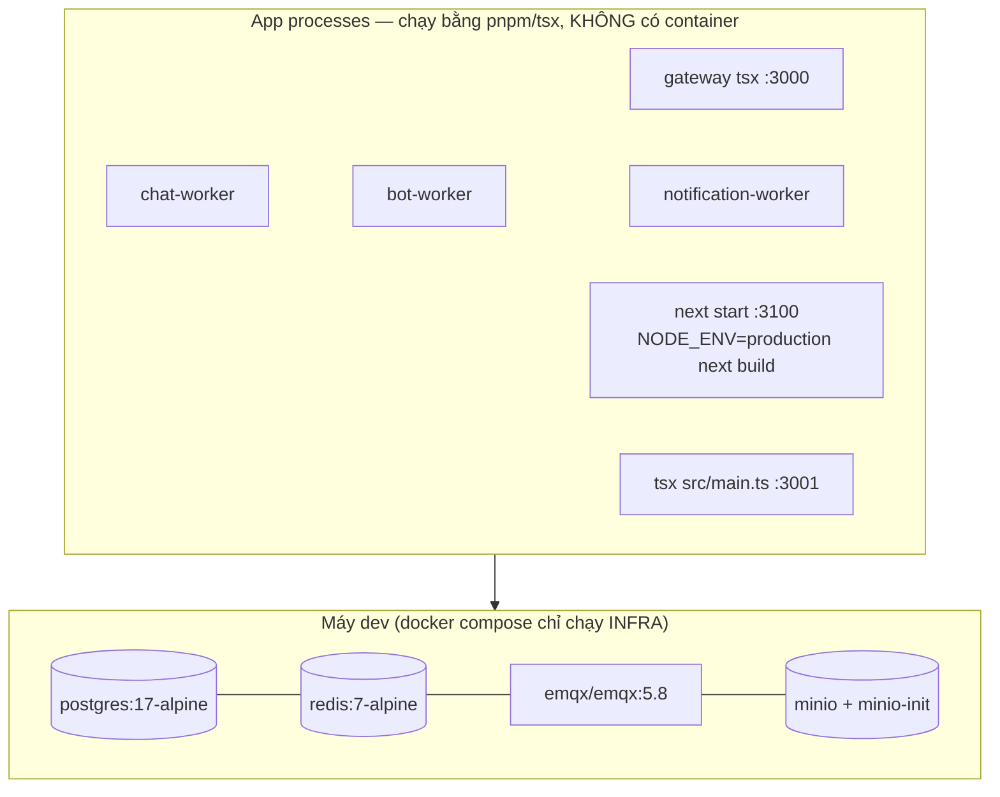

- Web là app duy nhất có production build script (`next build`); api/workers/gateway chạy TS trực tiếp bằng `tsx` kể cả `start`.
- **Không tồn tại trong repo:** Dockerfile cho app nào, CI workflow (.github absent), reverse proxy ngoài gateway (nginx/caddy/traefik: 0), cloud/k8s/terraform config, TLS termination config.
- Env vars bắt buộc (tên, qua zod fail-fast): `DATABASE_URL, REDIS_URL, MQTT_URL, S3_ENDPOINT/S3_REGION/S3_BUCKET/S3_ACCESS_KEY/S3_SECRET_KEY, API_URL`; gateway thêm `GATEWAY_PORT, WEB_ORIGIN, API_ORIGIN, EMQX_WS_ORIGIN`; client `NEXT_PUBLIC_API_URL, NEXT_PUBLIC_MQTT_WS_URL`; vận hành `LOG_LEVEL, NODE_ENV, MQTT_TOPIC_NAMESPACE`.

> **Kết luận trung thực:** repo evidence chỉ hỗ trợ **dev/demo stack**. Production deployment path: _không xác định được từ source hiện tại_.

## 33. Observability

**Đang có:**

- Structured logging: pino JSON, base `{service}`, ISO timestamp, level từ LOG_LEVEL, pretty trong dev (`packages/logger`).
- Correlation chain trong contract: `correlationId/causationId` trên envelope — chat-worker copy correlationId vào events phát ra; bot-worker set causationId dày đặc ⇒ trace được chuỗi user-command → bot-reply.
- Health: `GET /api/health` (DB SELECT 1 + Redis ping → ok/degraded); EMQX healthcheck trong compose; admin dashboard hiển thị health badge.
- Business dashboards: admin stats/events feed; outbox dump; bot logs (events/commands/executions).

**Observability gaps (xác minh được):**

1. Không metrics endpoint (prom-client/OTel: 0 dependency).
2. Không distributed tracing; correlationId không được sinh/tiếp nối ở API/gateway (requestId random mỗi lỗi).
3. API không log HTTP request/response (chỉ log exception chưa xử lý).
4. Outbox poison (>10 attempts) chỉ nằm trong cột `lastError` + 1 dòng log — không alert/DLQ.
5. bot/notification-worker ack trước khi xử lý ⇒ mất event im lặng khi crash (chỉ log).
6. Không error-reporting service (Sentry…).

## 34. Security

| Hạng mục         | Trạng thái                                                                                                                                                                                           |
| ---------------- | ---------------------------------------------------------------------------------------------------------------------------------------------------------------------------------------------------- |
| Input validation | ✅ Zod tại MQTT command boundary + REST body (ZodValidationPipe) + env; ⚠ query params (`actor`, `before/after`) parse tay                                                                           |
| SQL injection    | ✅ Prisma parameterised; 3 chỗ `$queryRaw` đều tagged-template an toàn                                                                                                                               |
| XSS              | ✅ Không dangerouslySetInnerHTML/innerHTML/eval; React escape mặc định                                                                                                                               |
| File validation  | ✅ MIME allowlist 9 loại + normalize alias + key pattern chống traversal + cap 50MB; ⚠ không magic-byte sniffing                                                                                     |
| Secrets          | `.env` git-ignored (biến S3_ACCESS_KEY/S3_SECRET_KEY…). ⚠ Credential demo hardcode trong docker-compose.yml (Postgres/MinIO default) và .env.example — chấp nhận được cho demo, phải xoay khi public |
| CORS             | ⚠ `origin:true` reflect mọi origin (comment nói "web/admin origins" nhưng thực chất mở hết)                                                                                                          |
| Rate limiting    | ❌ Không có ở API lẫn gateway (mapping code 429 tồn tại nhưng không gì sinh nó)                                                                                                                      |
| CSRF             | Risk thấp (không cookie/session) nhưng actor-as-query-param + CORS mở ⇒ API forgeable từ client nào biết id                                                                                          |
| MQTT ACL         | ❌ Không có — anonymous toàn bộ, mọi client nhận fan-out toàn bộ `events/#` (payload chứa nội dung mọi conversation)                                                                                 |

> Repository KHÔNG chứa credential production; các giá trị demo nằm trong compose/.env.example đã được ghi nhận nhưng **không sao chép vào tài liệu này**.

## 35. Important Design Decisions

1. **Tại sao có Chat Worker mà không để client persist trực tiếp?** — Client không tin được: cần một điểm duy nhất validate quyền, chống trùng, cấp sequence tuần tự, ghi DB nhất quán. Worker tách cũng cho phép scale độc lập qua $share.
   _(Evidence: worker.ts pipeline; .agent/rules/01-architecture.md)_
2. **Tại sao Commands ≠ Events?** — Tách "ý định" khỏi "sự thật": nhiều client cùng ý định chỉ sinh ra MỘT fact; consumer (UI/bot/notification) chỉ cần hiểu fact, không phải xử lý tranh chấp.
3. **Tại sao Transactional Outbox?** — Bài toán dual-write (ghi DB xong crash trước khi publish). Cùng transaction = atomicity; publisher retryable = at-least-once; eventId + idempotent consumers hấp thụ duplicates.
4. **Tại sao `clientMessageId`?** — QoS1 redelivery + client retry đều gây duplicate ở biên giới mạng; unique constraint biến "gửi lại" thành no-op rẻ nhất có thể (catch P2002), đồng thời là khoá để optimistic UI đối chiếu.
5. **Tại sao sequence theo conversation (UPDATE … RETURNING)?** — Chat cần thứ tự trong hội thoại chứ không toàn cục; row-lock UPDATE tránh race của MAX+1; sequence còn làm cursor pagination + gap detection + read watermark.
6. **Tại sao contracts tập trung 1 package?** — Topic string/schema trôi nổi ở N chỗ sẽ lệch nhau; một package duy nhất = compiler là người bảo vệ hợp đồng (kèm rule lint cấm import mqtt ngoài 2 file).
7. **Architectural inference (suy luận, không có comment tuyên bố):** việc chọn MQTT-over-WebSocket thay vì WebSocket thuần tận dụng được QoS/LWT/shared-subscription có sẵn của broker — giảm lượng infra-code phải tự viết cho presence/reconnect/load-balance.

## 36. Strengths

- **Separation of concerns mẫu mực:** 13 packages có ranh giới rõ, dependency rule apps→packages được lint bảo vệ; topic/schema single-source.
- **Server-authoritative + optimistic UI:** UX tức thì mà vẫn nhất quán — mô hình tham chiếu tốt cho hệ thống chat thật.
- **Reliability có chiều sâu:** transactional outbox, unique idempotency constraint, watermark receipts, deferred-ack consumer, shared subscription scale-out, reconnect heal seq-scoped — mỗi cơ chế đều có test riêng chứng minh (duplicate/dedup/idempotency suite).
- **Test culture hiếm thấy ở demo:** 92 vitest + 35 jest + 9 E2E suites isolated-stack + browser E2E single-origin gate + 2 acceptance probe; completion gate tự động đọc ledger P0.
- **Contract-first realtime:** mọi payload qua Zod; versioned envelope với correlation/causation sẵn sàng cho tracing tương lai.
- **Bot như công dân hạng nhất:** bot response đi cùng canonical pipeline ⇒ không có đường tắt phá vỡ invariant.
- **Media read-time resolution:** durable key thay signed URL ⇒ không bao giờ có URL chết.

## 37. Current Technical Risks (P0–P3)

> Chỉ liệt kê mục có evidence code. Không sửa code trong tài liệu này.

### P0 — Critical (chặn production)

1. **Không có authentication end-to-end**: HTTP anonymous + actor query-param tự khai báo; MQTT anonymous không ACL; mọi client nhận toàn bộ event payload mọi conversation (`EMQX_ALLOW_ANONYMOUS`, main.ts:20, chat.controller.ts:159).
2. **Thiếu authorization guard nghiêm trọng**: đọc history bất kỳ conversation không check membership/tombstone (chat.controller.ts:724-769); upload chéo conversation (uploads.controller.ts:96-104); `/api/admin/*` + bots CRUD + DELETE user public.
3. **No CI/CD, no containerization cho apps** — không có path tái lập deploy (find Dockerfile = 0, .github = 0).

### P1 — High

4. **Outbox poison không có DLQ/alert**: >10 attempts nằm lại vĩnh viễn, chỉ lastError (outbox.ts:73,100-106).
5. **bot-worker & notification-worker ack-trước-xử-lý**: crash giữa chừng mất event; BotEventLog.eventId không UNIQUE nên dedup không được DB đảm bảo (schema.prisma:197-210).
6. **Presence lease không tồn tại**: connection keys không TTL; LWT thất bại ⇒ user online-ma vĩnh viễn (redis/src/index.ts:40-46).
7. **Redelivery loop tiềm ẩn**: P2002 do collision clientMessageId khác conversation → throw ⇒ redeliver vô hạn (`messages.ts:208-212` — suy luận từ code path, chưa có runtime repro). Ngoài ra edit/reaction.add/presence.set re-emit event mỗi redelivery.
8. **Upload memoryStorage 50MB** buffer toàn bộ trong RAM mỗi request (multer default) — DoS rẻ.
9. **CORS mở hoàn toàn + zero rate-limit** (main.ts:20; không throttler).

### P2 — Medium

10. Edit/reaction/presence không kiểm tra conversation tombstone (chỉ send check) — thao tác trên nhóm đã xoá vẫn xử lý được (messages.ts:224-236, reactions.ts:18-27).
11. Dead contracts gây nhiễu: `conversation.updated`, `media.uploaded`, `system.error`, flat receipt topics, `EVENT_SCHEMAS` thiếu receipt.delivered và không consumer dùng (topics.ts:45-50, events.ts:173-189).
12. delivered receipt half-implemented (server đủ, client dead-end) — dễ gây hiểu nhầm khi onboarding.
13. Parity lệch web/mobile: queued-timeout 30s vs 10s; gap-detection chỉ web; Device.platform luôn "web".
14. Không có graceful shutdown ở API (enableShutdownHooks absent) — kill đột ngột cắt request đang bay.
15. MinIO image `latest` floating tag — không reproducible builds.

### P3 — Improvement

16. Rename-group feature thiếu dù UI handle `conversation.updated` (dead path).
17. Typing stop-expiry không sinh event từ Redis TTL expiry (keyspace notification chưa dùng).
18. Upload progress bar chưa có (boolean uploading); orphan objects khi upload xong không gửi message.
19. `.agent/rules/01-architecture.md` + `04-frontend-uiux.md` hỏng text (lặp đoạn); rules 10-testing ghi Playwright nhưng thực tế puppeteer-core.
20. getDb() singleton, refreshTyping, getDelivery, conversationEventTopic builder — dead code chưa dọn.

---

# PHẦN IX — TÓM TẮT & TÀI LIỆU THUYẾT TRÌNH

## 38. Glossary

| Term                               | Meaning                                                                                                             |
| ---------------------------------- | ------------------------------------------------------------------------------------------------------------------- |
| **MQTT**                           | Giao thức pub/sub gọn nhẹ qua broker; ở đây chạy EMQX 5.8                                                           |
| **Broker**                         | "Bưu điện" trung gian phân phát message theo topic (EMQX)                                                           |
| **Topic**                          | Địa chỉ chủ đề phân tầng `/`, vd `chat/v1/events/message/created`                                                   |
| **Publish / Subscribe**            | Gửi lên topic / nhận theo topic đã đăng ký                                                                          |
| **QoS 0/1/2**                      | Mức đảm bảo giao hàng: tối đa 1 lần / ít nhất 1 lần (có trùng) / đúng 1 lần. Hệ thống dùng 0 (typing) + 1 (còn lại) |
| **Retained message**               | Broker giữ tin cuối cho subscriber mới — hệ thống KHÔNG dùng                                                        |
| **Last Will (LWT)**                | "Di chúc" broker publish giúp khi client mất nối — dùng cho presence offline                                        |
| **Keepalive**                      | Ping định kỳ phát hiện chết nối — 30s                                                                               |
| **Shared subscription (`$share`)** | Nhiều instance một group chia nhau nhận — scale-out worker                                                          |
| **Worker**                         | Process backend tiêu thụ event/command làm việc nặng (chat/bot/notification)                                        |
| **Contract**                       | Hợp đồng dữ liệu Zod giữa các thành phần (`mqtt-contracts`)                                                         |
| **Command vs Event**               | Yêu cầu client xin vs sự thật server phát sau khi commit DB                                                         |
| **Canonical Event**                | Event chính thức duy nhất của một thay đổi, mang sequence, mọi bên tin theo                                         |
| **Transactional Outbox**           | Ghi dữ liệu + hàng đợi sự kiện cùng 1 transaction, publisher rút ra sau                                             |
| **Idempotency**                    | Xử lý nhiều lần vẫn như xử lý 1 lần (clientMessageId unique, watermark)                                             |
| **Deduplication**                  | Loại bản sao do redelivery/retry                                                                                    |
| **Sequence**                       | Số thứ tự tin trong conversation, cấp bằng `UPDATE lastSequence+1 RETURNING` trong tx                               |
| **Watermark**                      | Mốc cao nhất đã đọc/giao per member (`lastReadSequence`)                                                            |
| **Optimistic UI**                  | Hiện ngay bản nháp pending trước khi server xác nhận                                                                |
| **Reconciliation**                 | Đối chiếu optimistic entry với canonical event theo `clientMessageId`                                               |
| **Gap detection**                  | Thấy sequence hở → chủ động backfill bằng HTTP cursor                                                               |
| **Source of Truth**                | Nơi dữ liệu chính thức sống — PostgreSQL (+ MinIO với media)                                                        |
| **Eventual Consistency**           | Bản sao phía client có thể trễ chốc lát rồi hội tụ về SoT                                                           |
| **Tombstone**                      | Soft-delete marker (`deletedAt/deletedBy`) thay xoá cứng                                                            |
| **Deferred Ack**                   | PUBACK chỉ gửi sau khi handler settle ⇒ crash-safe redelivery                                                       |
| **Nack**                           | Cố tình không gửi PUBACK cho một message ⇒ broker sẽ giao lại (redeliver)                                           |
| **Poison message**                 | Message gây lỗi lặp lại mỗi lần xử lý; ở đây outbox row quá 10 attempts nằm lại vĩnh viễn                           |
| **DLQ (Dead-Letter Queue)**        | Hàng đợi riêng chứa message lỗi để xử lý sau — hệ thống hiện KHÔNG có                                               |
| **P2002**                          | Mã lỗi unique-constraint violation của Prisma — được dùng làm tín hiệu dedup                                        |
| **SKIP LOCKED**                    | Mệnh đề SQL `FOR UPDATE SKIP LOCKED`: nhiều worker poll cùng hàng đợi mà không giành nhau cùng một row              |
| **Pair Key**                       | `directPairKey` chuẩn hoá cặp DM chống trùng hội thoại                                                              |

---

## 39. Hệ thống hoạt động thế nào trong 2 phút?

```text
Người dùng gõ một tin nhắn và bấm Send.

↓
Ứng dụng sinh mã định danh riêng cho tin nhắn (clientMessageId)
và hiện NGAY bong bóng "đang gửi" — người dùng không phải chờ.

↓
Tin nhắn được đăng lên hạ tầng nhắn tin realtime (MQTT broker EMQX)
dưới dạng một LỆNH, không phải kết quả.

↓
Một worker duy nhất (chat-worker) nhận lệnh:
kiểm tra người gửi có quyền không · dữ liệu có hợp lệ không ·
có bị trùng không (nếu trùng — bỏ qua, vô hại).

↓
Trong MỘT giao dịch database:
cấp số thứ tự cho tin nhắn, lưu phiên bản chính thức,
và xếp hàng một SỰ KIỆN chính thức.

↓
Bộ phát sự kiện rút hàng đợi và phát sự kiện ra broker.

↓
Người nhận đang online thấy tin gần như tức thời;
chính người gửi cũng dựa vào sự kiện này để chuyển
"đang gửi" thành "đã gửi", rồi "đã đọc".

↓
Bot và notification-worker cũng nghe sự kiện đó:
bot trả lời bằng CÙNG đường ống chuẩn,
worker thông báo chỉ đẩy thông báo cho người đang OFFLINE.

Nếu mạng đứt: ứng dụng xếp tin vào hàng chờ,
tự kết nối lại, hỏi server "mình còn thiếu từ số mấy"
và tự vá khoảng trống — không mất, không trùng.
```

---

## 40. Architecture At A Glance

> **Tóm tắt một đoạn:** MQTT Chat là nền tảng chat realtime demo nơi client chỉ gửi _lệnh_, một chat-worker duy nhất kiểm tra–chống trùng–cấp số thứ tự–ghi PostgreSQL cùng hàng đợi sự kiện (transactional outbox), rồi phát _sự kiện chính thức_ qua broker EMQX cho web, mobile, bot và notification-worker. Database là nguồn sự thật duy nhất; UI optimistic chỉ là bản nháp chờ đối chiếu. Toàn bộ topic + schema gom về một package hợp đồng Zod, được bảo vệ bởi 127 unit test, 9 E2E suite và gate ladder tự động.

- **Clients:** Web Next.js 16 (chat + admin dashboard) & React Native 0.87 mobile — cả hai chỉ chạm đúng một origin public :3000; identity demo không auth.
- **Backend:** NestJS 11 REST API (history/upload/group lifecycle/admin) + gateway reverse proxy thuần Node.
- **Messaging:** EMQX 5.8 MQTT broker — namespace `chat/v1`; commands (client→worker) tách biệt events (worker→everyone); QoS1 mặc định, QoS0 cho typing.
- **Workers:** chat-worker (authority: validate → dedup → sequence → transactional outbox → publish), bot-worker (rule/command/scheduler), notification-worker (offline push console).
- **Database:** PostgreSQL 17 + Prisma — 13 models; source of truth tuyệt đối; outbox row cùng transaction.
- **Contracts:** một package Zod duy nhất (`mqtt-contracts`) chứa toàn bộ topic + schema + QoS + MIME policy; versioned envelope có correlation/causation.
- **Realtime:** MQTT-over-WebSocket; global wildcard subscription; LWT presence; shared subscriptions scale-out 3 group worker.
- **Reliability:** idempotency end-to-end (unique clientMessageId, eventId, watermark), reconnect heal theo sequence, offline queue, retry thủ công + outbox retryable.
- **Testing:** 92 vitest + 35 jest-mobile + 9 E2E suites trên isolated stack (DB test riêng, namespace fence) + browser E2E single-origin + 2 acceptance probe; gate ladder `verify:all`.
- **Deployment:** Docker Compose cho infra; apps chạy pnpm/tsx; chưa có CI/Dockerfile/production path.

---

## 41. PRESENTATION OUTLINE

> Phiên bản dành cho Motion / AI Presentation — 20 slides. Mỗi slide gồm Main message + Key points + Suggested visual.

### Slide 1 — MQTT Chat System

**Main message:** Một nền tảng chat realtime hoàn chỉnh được xây quanh MQTT — nơi database là nguồn sự thật duy nhất và người dùng vẫn có trải nghiệm tức thì.
**Key points:**

- Web + Mobile + Bot + Admin trên cùng một hợp đồng dữ liệu
- Kiến trúc server-authoritative minh họa chuẩn công nghiệp
- Toàn bộ chạy local: 1 câu lệnh `pnpm dev`
  **Suggested visual:** Mockup 4 client cạnh nhau (web · mobile · admin dashboard · bot) cùng nói chuyện trong một khung chat.

### Slide 2 — Bài toán hệ thống giải quyết

**Main message:** Chat realtime dễ làm sai theo 4 cách: mất tin, trùng tin, sai thứ tự, UI nói dối.
**Key points:**

- Mạng chập chờn ⇒ tin biến mất hoặc nhân đôi (QoS1 redelivery)
- Nhiều người gửi đồng thời ⇒ thứ tự lộn xộn
- Optimistic UI sai ⇒ người dùng tin trạng thái chưa chắc chắn
- Hệ thống giải cả 4: idempotency · sequence · outbox · reconcile
  **Suggested visual:** 4 ô đỏ (vấn đề) → mũi tên → 4 ô xanh (cơ chế).

### Slide 3 — MQTT là gì?

**Main message:** MQTT là mô hình publish/subscribe qua một "bưu điện" trung tâm (broker) — người gửi không cần biết ai nhận.
**Key points:**

- Publisher → Topic → Broker → Subscribers
- Topic phân tầng như địa chỉ: `chat/v1/events/message/created`
- Sinh ra cho IoT: nhẹ, tiết kiệm, tin cậy theo mức QoS
  **Suggested visual:** Diagram 4 (MQTT Pub/Sub) — một broker, ba receiver khác màu.

### Slide 4 — MQTT hoạt động thế nào (QoS, LWT, Wildcard)

**Main message:** Ba cơ chế MQTT mà hệ thống tận dụng triệt để: QoS1 chống mất tin, Last Will báo offline, wildcard fan-out.
**Key points:**

- QoS 0 = nhanh, chấp nhận mất (typing)
- QoS 1 = at-least-once (tin nhắn); trùng do redelivery → idempotency xử lý
- LWT: client mất điện → broker tự phát "user offline"
- `$share/{group}`: nhiều worker chia nhau tải như một team
  **Suggested visual:** Timeline mất kết nối → LWT fire → dot xám.

### Slide 5 — Tổng quan hệ thống

**Main message:** Một origin public duy nhất, bốn dịch vụ backend, bốn hạ tầng — mỗi khối một nhiệm vụ.
**Key points:**

- Gateway :3000 = cửa duy nhất (HTTP → API, WS /mqtt → broker)
- chat-worker là thẩm quyền; bot/notification là người nghe
- Postgres = sự thật, Redis = state tạm, MinIO = file
  **Suggested visual:** Diagram 1 (High-Level Architecture).

### Slide 6 — Technology Stack

**Main message:** Một stack TypeScript end-to-end hiện đại, chọn vì độ tin cậy chứ không phải thời trang.
**Key points:**

- Frontend: Next.js 16 + React 19 + zustand; Mobile: React Native bare
- Backend: NestJS 11 · mqtt.js · Prisma 6 · ioredis · Zod contracts
- Infra: PostgreSQL 17 · Redis 7 · EMQX 5.8 · MinIO (S3)
  **Suggested visual:** Bản đồ stack 4 tầng với logo.

### Slide 7 — Luồng command → event (Commands ≠ Events)

**Main message:** Client xin. Worker quyết định. Mọi bên tin vào fact.
**Key points:**

- Client publish command → broker → đúng 1 chat-worker ($share)
- Worker validate + ghi DB + outbox trong 1 transaction
- Fact phát ra sau commit → UI/bot/notification đều nghe
  **Suggested visual:** Diagram 3 (Canonical Message Pipeline).

### Slide 8 — Các component & vai trò

**Main message:** 13 packages có ranh giới rõ: contracts là hiến pháp, workers là hành pháp.
**Key points:**

- `mqtt-contracts`: mọi topic + schema — cấm hardcode nơi khác
- 7 service, mỗi service một lý do tồn tại duy nhất
- Dependency rule: apps → packages, không vòng
  **Suggested visual:** Inventory grid 8 ô kèm icon.

### Slide 9 — Message lifecycle (17 bước trong 1 trang)

**Main message:** 17 bước có chủ đích — mỗi bước chặn một loại lỗi.
**Key points:**

- clientMessageId + optimistic bubble ngay lập tức
- Worker: validate → dedup → sequence → TX(Message + Outbox)
- Outbox drain → canonical event → reconcile → receipt watermark
  **Suggested visual:** Diagram 2 (Send Message Sequence).

### Slide 10 — MQTT Topics & Contracts

**Main message:** Toàn bộ ngôn ngữ giao tiếp nằm trong một package hợp đồng Zod — compiler là người bảo vệ.
**Key points:**

- Namespace `chat/v1`: 10 command topics, 16 event types phát thật
- Envelope: eventId · correlationId · causationId · version
- Receipts đi topic cá nhân hoá `users/{id}/events/*`
  **Suggested visual:** Topic tree dạng thư mục.

### Slide 11 — Database

**Main message:** 13 bảng, một quy tắc vàng: dữ liệu nghiệp vụ và sự kiện outbox luôn commit cùng nhau.
**Key points:**

- User—Conversation—Message—Reaction; watermark read/delivered trên member
- UNIQUE(clientMessageId) + UNIQUE(conversationId, sequence) = hai lớp chống lỗi
- Tombstone thay xoá cứng cho group
  **Suggested visual:** Diagram 6 (Data Model ERD rút gọn).

### Slide 12 — Reliability: Idempotency & Ordering

**Main message:** Gửi lại nghìn lần vẫn chỉ có một tin — và thứ tự không bao giờ đảo.
**Key points:**

- Retry tái sử dụng clientMessageId → server catch P2002 → no-op
- Sequence cấp bằng UPDATE+RETURNING trong row-lock, không MAX+1
- Gap detection: thấy hở ga → tự backfill HTTP
  **Suggested visual:** Hai timeline song song (retry × 3 → 1 message).

### Slide 13 — Groups · Reply · Media

**Main message:** Ba luồng nghiệp vụ đầy đủ, mỗi luồng một mô hình phù hợp.
**Key points:**

- Group: REST + tombstone + role ADMIN/MEMBER; discovery realtime
- Reply: validate target cùng conversation; FK SetNull an toàn
- Media: upload MinIO durable key; MQTT chỉ mang metadata
  **Suggested visual:** 3 cột flow ngắn.

### Slide 14 — Presence · Typing · Notification · Bot

**Main message:** Realtime social features đặt đúng tầng lưu trữ: ephemeral thì Redis, quan trọng thì Postgres.
**Key points:**

- Presence: Redis set multi-device + LWT; grace 10s chống flicker
- Typing: TTL 8s, QoS0, không bao giờ persist
- Notification: chỉ push cho user OFFLINE; Bot trả lời qua cùng pipeline chuẩn
  **Suggested visual:** 4 lane ngang theo tầng (MQTT/Redis/PG).

### Slide 15 — Web & Mobile clients

**Main message:** Hai nền tảng, một hợp đồng: cùng optimistic model, khác phần render.
**Key points:**

- Web: zustand single store, scroll engine giữ vị trí khi load lịch sử
- Mobile: RN bare CLI, MessageLifecycleStore mirror web
- Offline queue + reconnect heal seq-scoped trên cả hai
  **Suggested visual:** Mockup 2 màn hình cạnh nhau.

### Slide 16 — Testing

**Main message:** Demo nhưng test nghiêm túc: 127 unit test + 9 E2E suite + browser E2E + 2 probe.
**Key points:**

- Isolated stack: DB test riêng, namespace MQTT riêng, guard chống chạm dev DB
- Suite chuyên chứng minh: duplicate, invalid reply, MIME, tombstone, presence LWT
- Browser E2E gate "zero internal request" + scroll/leak probes
  **Suggested visual:** Kim tự tháp test 3 tầng + con số.

### Slide 17 — Security & Observability

**Main message:** Minh bạch về giới hạn: validation tốt ở biên dữ liệu, nhưng auth là ranh giới cần vượt trước production.
**Key points:**

- Có: Zod mọi boundary, MIME allowlist, parameterised SQL, structured logs + correlationId
- Chưa: authentication/ACL/rate-limit/metrics/tracing — liệt kê trung thực
- Observability gaps được ghi lại có evidence, không tô hồng
  **Suggested visual:** Bảng 2 cột ✅/⚠️.

### Slide 18 — Deployment & Scalability

**Main message:** Dev-first hôm nay, production-ready tomorrow: các điểm mở rộng đã được thiết kế sẵn.
**Key points:**

- Compose infra + tsx processes; chưa có CI/Dockerfile (kế hoạch)
- Scale-out sẵn: $share groups cho cả 3 worker
- Stateless services + Postgres/Redis/MinIO tách biệt ⇒ horizontal-friendly
  **Suggested visual:** Roadmap dev → prod 3 bước.

### Slide 19 — Strengths & hướng phát triển

**Main message:** Những quyết định kiến trúc đáng học: outbox, idempotency, contract-first, test culture.
**Key points:**

- Strengths: separation of concerns · reliability depth · bot là công dân hạng nhất
- Direction: auth + ACL, DLQ/alerting, metrics/tracing, delivered receipts hoàn thiện
- Mỗi gap đã có evidence + vị trí code cụ thể
  **Suggested visual:** 2 cột Strengths / Roadmap.

### Slide 20 — Final architecture summary

**Main message:** _"Client xin. Server quyết định. Database ghi nhớ. Broker phát sóng."_
**Key points:**

- Mọi tin nhắn: command → validate → dedup → sequence → TX → canonical event
- Người dùng thấy ngay (optimistic), hệ thống hội tụ về sự thật
- Thiếu auth + ops để thành sản phẩm thật
  **Suggested visual:** Diagram tổng đóng khung 4 câu chốt.

---

## 42. Presentation Diagrams

### Diagram 1 — High-Level Architecture

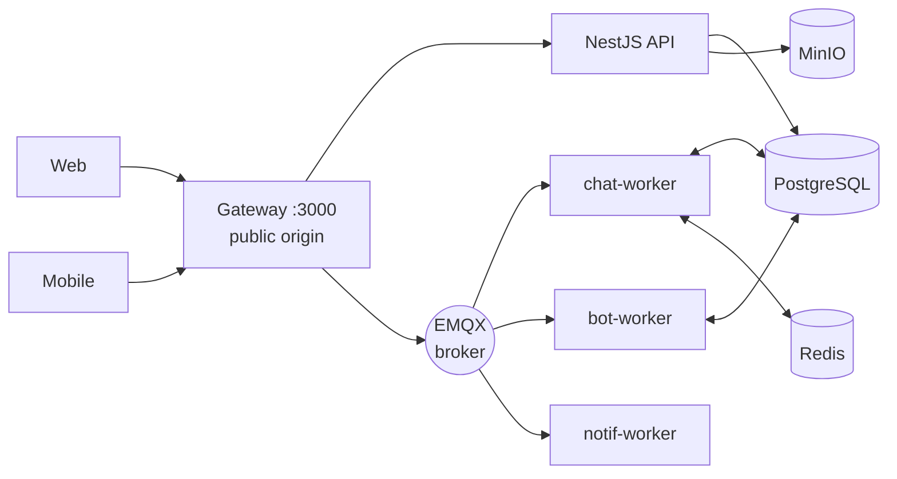

### Diagram 2 — Send Message Sequence

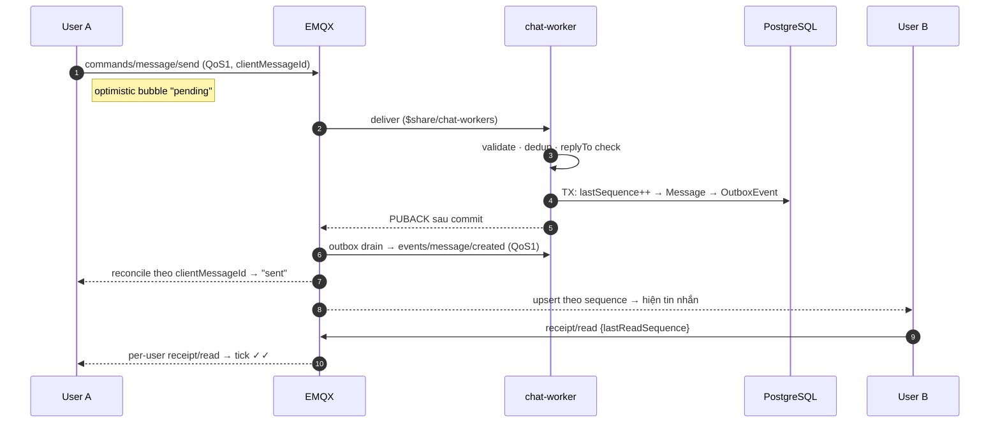

_(Bản rút gọn để lên slide — bản đầy đủ 17 bước có nhánh rejected xem §11.3)_

### Diagram 3 — Canonical Message Pipeline

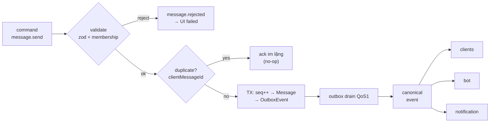

### Diagram 4 — MQTT Pub/Sub

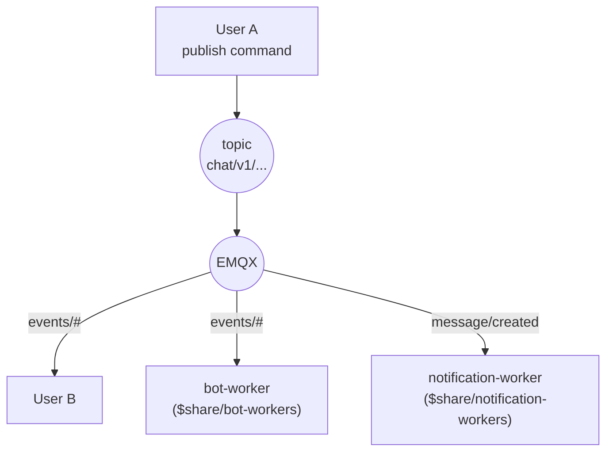

### Diagram 5 — Group Lifecycle

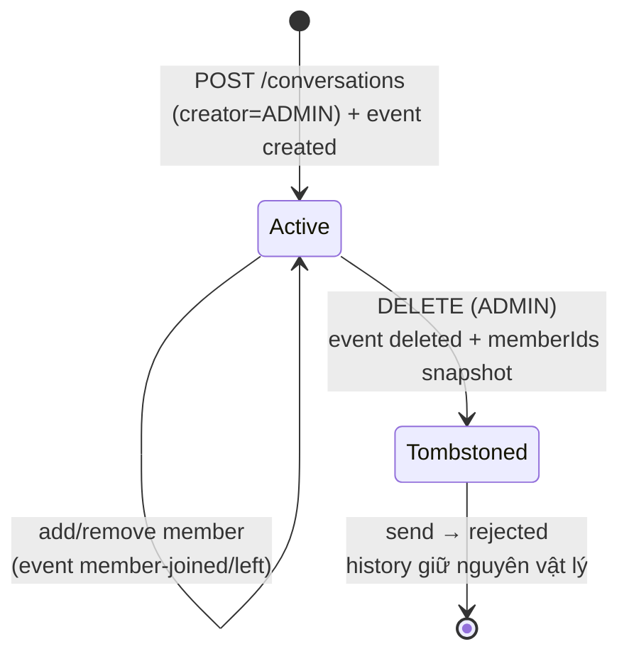

### Diagram 6 — Data Model (rút gọn)

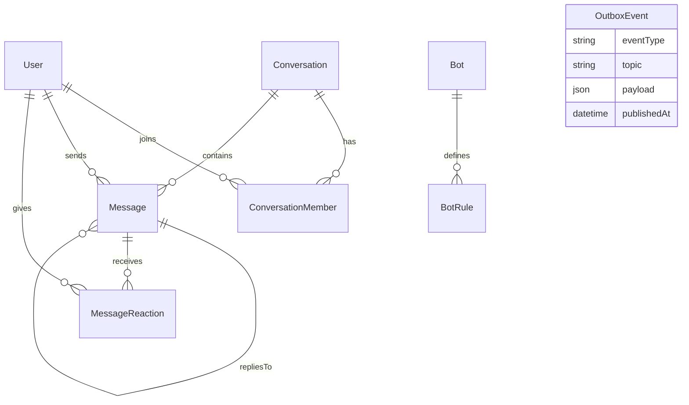

---

## 43. System Flow Cheat Sheet

| Flow              | Client                          | API                           | MQTT                           | Worker                          | DB                     | Result                                    |
| ----------------- | ------------------------------- | ----------------------------- | ------------------------------ | ------------------------------- | ---------------------- | ----------------------------------------- |
| Send message      | cmid + optimistic → publish cmd | —                             | `commands/message/send` QoS1   | validate·dedup·seq·TX·outbox    | Message + OutboxEvent  | `message.created` → sent ✓                |
| Edit message      | publish cmd                     | —                             | `commands/message/edit`        | author-only check               | content + editedAt     | `message.edited`                          |
| Delete message    | publish cmd                     | —                             | `commands/message/delete`      | author/ADMIN                    | soft delete            | `message.deleted`                         |
| Reaction          | publish cmd                     | —                             | `commands/reaction/add·remove` | membership                      | upsert/delete          | `reaction.added/removed`                  |
| Reply             | cmd + replyToId                 | —                             | như send                       | validate target cùng conv       | FK replyToId           | created mang replyToId / rejected         |
| Media             | upload file → cmd metadata-only | `POST /api/uploads` multipart | như send                       | pipeline chuẩn                  | Message.metadata       | `/media?key=` stream                      |
| Create group      | REST POST                       | create + members TX           | —                              | (drain outbox)                  | Conversation + members | `conversation.created` realtime discovery |
| Add/remove member | REST                            | guard ADMIN                   | —                              | (drain outbox)                  | member rows            | `member-joined/left`                      |
| Delete group      | REST DELETE                     | guard ADMIN                   | —                              | (drain outbox)                  | tombstone deletedAt    | `conversation.deleted`                    |
| Presence          | cmd on connect/disconnect + LWT | GET snapshot                  | `presence/set`                 | Redis SADD/SREM                 | Device.upsert          | `presence.online/offline`                 |
| Typing            | cmd throttle                    | —                             | `typing/set` QoS0              | Redis EX 8s                     | — (ephemeral)          | `typing.started/stopped` QoS0             |
| Read receipt      | publish khi stick-bottom        | —                             | `receipt/read`                 | watermark monotonic             | lastReadSequence       | per-user `receipt/read` → ✓✓              |
| Delivered         | _(không client nào gọi)_        | —                             | `receipt/delivered`            | watermark                       | lastDeliveredSequence  | half-implemented                          |
| Notification      | —                               | —                             | nghe `message.created`         | offline-check Redis             | —                      | Console push + audit Redis TTL 600s       |
| Bot response      | —                               | —                             | nghe events/# → `bot/send`     | pipeline chuẩn (senderType BOT) | Message BOT row        | reply như tin thường 🤖                   |
| History/backfill  | HTTP fetch cursor               | `GET …/messages?before/after` | —                              | —                               | SELECT theo sequence   | merge by id                               |

---

## 44. Final 30-Second Pitch

> _"MQTT Chat là nền tảng chat thời gian thực trả lời câu hỏi khó nhất của messaging: làm sao người dùng thấy tin ngay lập tức mà hệ thống không bao giờ mất, trùng hay đảo thứ tự? Câu trả lời là kiến trúc server-authoritative trên MQTT: client chỉ gửi lệnh; một worker duy nhất kiểm tra quyền, chống trùng bằng định danh client-side, cấp số thứ tự trong giao dịch database rồi phát sự kiện chính thức qua transactional outbox. Người dùng có trải nghiệm optimistic tức thì; database luôn là nguồn sự thật — bot, thông báo và mọi client hội tụ về cùng một thực tế. Đây là bản minh hoạ hoàn chỉnh, test E2E nghiêm túc, của những kỹ thuật mà các hệ thống messaging quy mô lớn đang dùng."_

_(~135 từ)_

---

# PHỤ LỤC

## Phụ lục A — Discrepancy docs-code

Code + schema + test hiện tại được ưu tiên; các tài liệu cũ dưới đây đã lệch so với implementation:

| #   | Docs nói                                                                                               | Code thực tế                                                                                                                                               |
| --- | ------------------------------------------------------------------------------------------------------ | ---------------------------------------------------------------------------------------------------------------------------------------------------------- |
| 1   | `docs/architecture.md:51`: clientMessageId unique **per conversation**                                 | UNIQUE **global** 1 cột (`schema.prisma:91`)                                                                                                               |
| 2   | `docs/message-flow.md:14`: duplicate → "re-publish canonical event"                                    | Duplicate → log + ack im lặng, KHÔNG re-publish (`messages.ts:195-207`)                                                                                    |
| 3   | `docs/architecture.md:48`: "only chat-worker publishes facts"                                          | Đúng ở tầng publish MQTT, nhưng **API** cũng ghi outbox rows cho conversation.* ; typing.* + message.rejected do worker publish TRỰC TIẾP không qua outbox |
| 4   | `docs/architecture.md:55`: MQTT mang "mediaUrl + metadata"                                             | Mang `metadata.storageKey`; URL resolve lúc đọc (`Composer.tsx:164-172`)                                                                                   |
| 5   | `docs/architecture.md` diagram vẽ "MinIO/R2" downstream của PostgreSQL                                 | Chỉ có MinIO; R2 không có config nào                                                                                                                       |
| 6   | `docs/mqtt-topics.md:21`: `commands/typing/set` QoS 0                                                  | Command publish QoS 1 (core); web chủ động override QoS 0; chỉ _event_ typing mới QoS 0                                                                    |
| 7   | `docs/mqtt-topics.md:33-41`: flat `events/receipt/*`, `media/uploaded`, `system/error` là event thật   | Flat receipt = dead constants (thực tế per-user topic); media.uploaded + system.error không có publisher                                                   |
| 8   | `docs/mqtt-topics.md:64`: "Web client only subscribes its conversations"                               | Web subscribe global `events/#` + user wildcard                                                                                                            |
| 9   | `docs/bot-system.md`: loop-protection skip theo senderType; unknown command có error reply; bảng rules | Skip theo `origin.type==="bot"`; unknown command im lặng; rules lệch nhiều chi tiết (trigger/tham số)                                                      |
| 10  | `.agent/rules/10-testing.md`: E2E dùng Playwright                                                      | puppeteer-core ^25.8 + system Chrome                                                                                                                       |
| 11  | Gateway docs liệt kê `/`,`/chat`,`/admin` route tường minh                                             | Catch-all về web; admin là page trong web (apps/admin đã xoá, commit e78e9cf)                                                                              |
| 12  | Comment nội bộ `MessageBubble.tsx:43-46` (presign 302)                                                 | Code chạy `/media?key=` stream — comment stale                                                                                                             |

## Phụ lục B — Unverified areas

Những điểm **không xác định được từ source hiện tại** (hoặc chỉ suy luận):

- Cấu hình runtime EMQX ngoài `EMQX_ALLOW_ANONYMOUS` (shared-subscription strategy, session limits, ACL sửa tay qua dashboard :18083).
- P2002 cross-conversation collision dẫn tới redelivery loop vô hạn: suy luận từ code path, chưa có runtime repro/test.
- Mức độ song song xử lý các delivery QoS1 trong 1 process chat-worker (mqtt.js nội bộ serialize packet — code không giới hạn tường minh).
- Hành vi mobile khi app bị kill trên thiết bị thật (LWT có fire không).
- Con số "95 PASS E2E / jest 24→35" trong HANDOFF là claim session trước — audit này đã chạy vitest (92 PASS) nhưng không tái lập E2E/browser/mobile suites.
- Deployment production (cloud, TLS, process manager): không có evidence trong repo.
- Template rule `{{sender}}` trong intro-capture nghi ngờ render rỗng (context key không tồn tại) — chưa chạy runtime xác nhận.
- Admin live-feed QoS: observer dùng base subscription của ChatRealtimeClient (QoS1); một báo cáo điều tra cũ ghi qos0 — đã đối chiếu source và lấy QoS1.
- Giá trị env thật trong `.env` — cố ý không đọc (quy tắc secrets).

---

_Hết tài liệu — soạn ngày 2026-08-25 từ audit toàn bộ repository MQTT-CHAT (14 luồng điều tra song song, mọi claim kèm tham chiếu source)._
